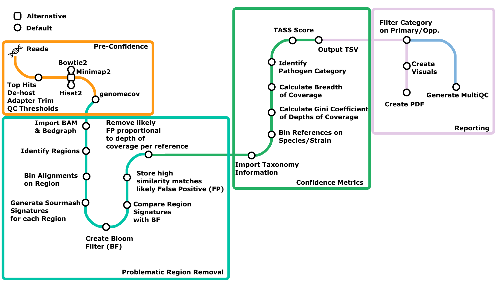
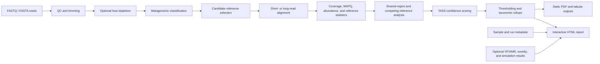
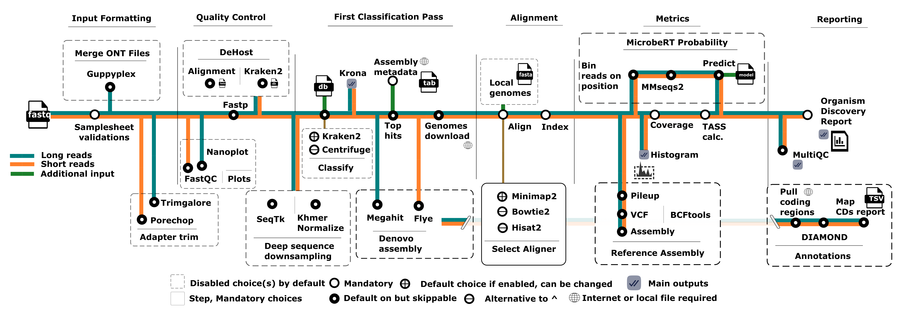

[](https://doi.org/10.1093/bioinformatics/btag119)
[](https://doi.org/10.5281/zenodo.17081353)
[](https://www.nextflow.io/)
[](https://www.docker.com/)
[](https://sylabs.io/docs/)
[](https://jhuapl-bio.github.io/taxtriage/)
[](https://jhuapl-bio.github.io/taxtriage/demo-report/)

# TaxTriage

**TaxTriage is a metagenomic decision-support workflow—not simply a collection of QC, classification, and alignment tools.** It converts short- or long-read metagenomic sequencing data into organism-level evidence, resolves ambiguous alignments among related references, ranks detections with the **TASS confidence score**, and packages the results in a self-contained, highly interactive HTML report.

Many metagenomic Nextflow workflows end with tool-specific files and a MultiQC summary. TaxTriage adds a post-alignment interpretation layer designed to help users answer harder questions:

- Is an organism supported by distributed, high-quality, reference-specific evidence rather than a small ambiguous pileup?
- How should evidence be interpreted when reads align to several closely related organisms or strains?
- Which detections remain credible after shared regions and competing references are considered?
- How do detections vary across samples, specimens, time points, locations, hosts, diseases, and other supplied metadata?

> TaxTriage is intended for research, surveillance, and early-stage outbreak investigation. It is not intended for use as a standalone diagnostic capability.

[**Open the interactive report demonstration**](https://jhuapl-bio.github.io/taxtriage/demo-report/) · [**Read the TASS scoring documentation**](https://jhuapl-bio.github.io/taxtriage/tass-scoring/) · [**Browse the full documentation**](https://jhuapl-bio.github.io/taxtriage/)

## What TaxTriage contributes

| Capability                 | Typical workflow endpoint               | TaxTriage contribution                                                                                    |
| -------------------------- | --------------------------------------- | --------------------------------------------------------------------------------------------------------- |
| QC and preprocessing       | Read-quality and trimming summaries     | Reproducible short- and long-read preprocessing connected to downstream organism evidence                 |
| Taxonomic classification   | Classifier counts and abundance tables  | Classifier output used as supporting evidence rather than treated as the final answer                     |
| Reference alignment        | BAM, depth, and coverage files          | Post-alignment evidence extraction and organism-level interpretation                                      |
| Confidence assessment      | Fixed read-count or coverage thresholds | **TASS**, a configurable 0–100 confidence score combining complementary evidence features                 |
| Closely related references | Similar hits reported independently     | Shared-sequence and cross-mapping analysis that reduces ambiguous support                                 |
| Reporting                  | MultiQC and static result tables        | A self-contained, cross-sample **interactive investigation environment** plus static deliverables         |
| Metadata                   | Metadata retained in a samplesheet      | Maps, longitudinal plots, geographic comparisons, host/disease analyses, filtering, and specimen grouping |

## The two defining outputs

### 1. TASS: post-alignment organism confidence

The **Threat Agnostic Sentinel Surveillance (TASS) score** is a normalized organism-level confidence score between 0 and 1. It is calculated after candidate organisms have been aligned and is designed to distinguish broad, coherent, organism-specific evidence from weak, localized, or ambiguous support.

Depending on enabled options, the score can incorporate:

- **Breadth of coverage**, transformed for sample-type-specific expectations and scaled by high-quality alignment support.
- **Coverage uniformity**, using a Gini-derived feature to distinguish genome-wide evidence from localized pileups.
- **MinHash/shared-region reduction**, measuring how much support remains after competing references and shared sequence are considered.
- **Mapping quality, abundance, classifier agreement, body-site context, protein identity, and plasmid evidence**.
- **Species- and genus-level rollups**, allowing evidence split among near-identical strains to be interpreted at an appropriate taxonomic level.

TASS is not a renamed Kraken2 confidence value or a single coverage cutoff. It is a post-alignment synthesis of multiple evidence types with configurable weights, transformations, and thresholds. The equations, default weights, conflict-resolution logic, and optimization approach are documented in the [TASS scoring documentation](https://jhuapl-bio.github.io/taxtriage/tass-scoring/).



### 2. A self-contained interactive investigation report

TaxTriage generates `report/all.odr.html`, a multi-sample report that opens in a modern browser and can be distributed as a single file. It is designed for active investigation rather than passive viewing.

The report includes, when corresponding data are available:

- Organism-by-sample TASS heatmaps with adjustable cutoffs.
- Strain, species, and genus views with rollup-rescue indicators.
- TASS distributions, genome coverage profiles, and per-position histograms.
- Taxonomic sunbursts, sortable tables, scatter/bubble plots, and correlograms.
- Cross-sample comparisons, co-occurrence analyses, and prevalence views.
- Geographic maps and choropleths driven by supplied location metadata.
- Longitudinal analyses driven by collection dates or times.
- Host, disease, environmental-site, and other metadata comparisons.
- Reversible merging of related libraries into specimen-level views.
- Virulence-factor and antimicrobial-resistance summaries when enabled.
- Novelty/open-set and in-silico dilution analyses when those modules are run.
- Browser-side filtering, recoloring, metadata editing, and export.

The interactive report complements MultiQC rather than replacing it. MultiQC summarizes process and tool QC; the TaxTriage report integrates organism evidence and metadata into an exploratory analytical product.

## Workflow at a glance





## Supported use cases

TaxTriage processes untargeted DNA or RNA sequencing from complex human, animal, or environmental samples, including respiratory swabs, lesion swabs, whole blood, saliva, stool, and related specimen types. It supports:

- Illumina short reads, including paired-end data.
- Oxford Nanopore and PacBio long reads.
- Single-sample and multi-sample runs.
- Docker and SingularityCE containerized execution.
- Workstations, HPC systems, cloud deployments, and offline environments.

The achievable reporting resolution depends on sequence quantity, quality, and uniqueness. Species-level calls are often possible; strain, variant, or clade resolution requires sufficient discriminating sequence.

## Quick start

### Requirements

1. [Nextflow](https://www.nextflow.io/docs/latest/getstarted.html#installation) (`>=24`)
2. [Docker](https://docs.docker.com/engine/install/) or [SingularityCE](https://docs.sylabs.io/)
3. Java 11 or later

> **Nextflow 26 compatibility:** TaxTriage currently requires the legacy syntax parser with Nextflow 26+. Set `NXF_SYNTAX_PARSER=v1` while strict-syntax support is completed. Nextflow 24–25 do not require this setting.

### Run the test profile

```bash
nextflow run https://github.com/jhuapl-bio/taxtriage \
  -r main \
  -profile test,docker \
  -resume
```

For SingularityCE, replace `docker` with `singularity`.

```bash
nextflow run https://github.com/jhuapl-bio/taxtriage \
  -r main \
  -profile test,singularity \
  -resume
```

See the [documentation site](https://jhuapl-bio.github.io/taxtriage/) for samplesheet preparation, database setup, cloud execution, offline operation, and the complete parameter reference.

## Installation

### Install Nextflow

```bash
java -version
curl -fsSL get.nextflow.io | bash
mkdir -p ~/bin
mv nextflow ~/bin/
nextflow -version
```

Alternatively, install Nextflow globally:

```bash
sudo mv nextflow /usr/local/bin/
```

### Install a container runtime

Use one of the following:

- [Docker installation guide](https://docs.docker.com/engine/install/)
- [SingularityCE installation guide](https://docs.sylabs.io/)

You do not need both. Docker is generally simplest on workstations; SingularityCE is commonly used on HPC systems.

## Running local data

```bash
nextflow run https://github.com/jhuapl-bio/taxtriage \
  -r main \
  -profile local,docker \
  --input examples/Samplesheet.csv \
  --db viral \
  --download-db \
  --outdir output_viral \
  -resume
```

Using a local Kraken2 database:

```bash
nextflow run https://github.com/jhuapl-bio/taxtriage \
  -r main \
  -profile local,docker \
  --input examples/Samplesheet.csv \
  --db /absolute/path/to/k2_database \
  --outdir output_local_db \
  -resume
```

For current options, use the [CLI parameter reference](https://jhuapl-bio.github.io/taxtriage/cli-parameters/).

## Pre-aligned (BAM/CRAM) input

If alignments already exist, TaxTriage can start from them. Pre-aligned samples skip every upstream
stage — compression, trimming, QC plots, host depletion, subsampling, classification and reference
downloading — and go straight to coverage statistics, scoring (`match_paths.py`) and the report.

Because no classifier runs to select references, supply the reference the file was aligned against
with `--reference_fasta`. It provides both the accession → taxid map (`match_paths.py -m`) and the
sourmash/ANI comparison (`match_paths.py -f`), so reference names in the BAM header must match the
accessions in that FASTA.

If `--reference_fasta` is omitted, the reference sequence is reconstructed from the alignment itself
with `samtools consensus` and used in its place — see [Consensus-derived
references](#consensus-derived-references) below for the trade-offs.

```bash
nextflow run https://github.com/jhuapl-bio/taxtriage \
  -profile docker \
  --bam examples/data/prealigned_sample.bam \
  --sample prealigned_sample --platform ILLUMINA --type nasal \
  --reference_fasta references/pathogens.fasta \
  --outdir output_bam
```

A samplesheet may instead carry a `bam` column, and may mix pre-aligned and FASTQ rows (`fastq_1` is
ignored wherever `bam` is set):

```csv
sample,platform,bam,type
prealigned_sample,ILLUMINA,examples/data/prealigned_sample.bam,nasal
```

```bash
nextflow run https://github.com/jhuapl-bio/taxtriage \
  -profile docker \
  --input examples/samplesheet_bam.csv \
  --reference_fasta references/pathogens.fasta \
  --outdir output_bam
```

- `.bam`, `.cram` and `.sam` are accepted; files are converted and coordinate sorted only when
  needed, then CSI indexed. Use `--cram_reference` when CRAM decoding needs a different FASTA.
- The alignment is used as given; `--bam_minmapq <n>` applies a MAPQ filter first.
- Read count is taken from the primary, non-supplementary records in the file.
- Options requiring raw reads or de novo contigs (`--use_denovo`, `--use_diamond`, `--annotate`,
  `--microbert`, `--novelty`, `--generate_iss`, `--generate_nanosim`, `--reference_assembly`,
  `--get_variants`) are disabled with a warning on a BAM-only run.

### Consensus-derived references

A BAM header records reference names and lengths but no bases. `match_paths.py` already falls back to
the header for reference _lengths_, but sourmash sketching, the shared-window conflict report and the
ANI matrix all need sequence. When no `--reference_fasta` is given, TaxTriage therefore calls a
per-reference consensus straight off the alignment (`samtools consensus -a`, N-padded so consensus
coordinates still match the original reference) and treats the result exactly like a user-supplied
FASTA: fuzzy-matched against the assembly summary for the accession → taxid map, and passed to
`match_paths.py -f` for sketching.

Two limitations are inherent to this and are printed as a warning at run time:

- **Coverage-limited.** Only positions with aligned reads are recovered; ANI and containment are
  effectively computed over the covered fraction of each reference. References recovering fewer than
  `--consensus_min_bases` (default 500) non-N bases are dropped rather than contributing empty
  sketches.
- **Multimapping bias.** A read placed on several references contributes to the consensus of each,
  so related organisms look more similar than their true genomes are, which makes conflict-driven
  read removal more aggressive.

Supply `--reference_fasta` whenever the true reference is available. Related options:
`--bam_consensus true|false` (force on / opt out), `--consensus_min_depth`, `--consensus_min_bases`,
`--consensus_min_mapq`, `--consensus_mode simple|bayesian`. With `--bam_consensus false` and no
reference, the run proceeds without sketch-based conflict analysis — pair it with
`--minhash_weight 0` so the TASS weights rebalance.

## Offline and reproducible operation

Clone the repository when local modifications, pinned code, or offline execution are required:

```bash
git clone https://github.com/jhuapl-bio/taxtriage.git
cd taxtriage
nextflow run ./main.nf -profile test,docker -resume
```

The interactive report can be built for offline viewing. See the [Interactive Report documentation](https://jhuapl-bio.github.io/taxtriage/interactive-report/) for `--offline_report` and `--offline_report_files`.

When Nextflow reports conflicting uncommitted changes in a remotely cached pipeline:

```bash
nextflow drop -f https://github.com/jhuapl-bio/taxtriage
```

## Major workflow stages

1. Optional subsampling or digital normalization.
2. Platform-specific QC and adapter trimming.
3. Optional host depletion.
4. Read-level classification with Kraken2 or Centrifuge.
5. Candidate-organism and reference selection.
6. Alignment with BWA-MEM2 or Minimap2.
7. Per-reference coverage, quality, and abundance calculations.
8. Shared-region and competing-reference conflict analysis.
9. TASS calculation, thresholding, and taxonomic rollup.
10. Optional assembly, protein annotation, novelty detection, and simulation analysis.
11. MultiQC, static outputs, and the interactive Organism Discovery Report.

Pre-aligned (BAM/CRAM) samples enter at stage 7; stages 1–6 and 10 are skipped for them.

Detailed descriptions are available in [Pipeline Modules](https://jhuapl-bio.github.io/taxtriage/pipeline-modules/).

## Important outputs

| Output                      | Purpose                                                 |
| --------------------------- | ------------------------------------------------------- |
| `report/all.odr.html`       | Interactive, multi-sample organism investigation report |
| Per-sample ODR PDF          | Static archival summary for an individual sample        |
| `*.paths.json`              | Structured organism evidence used by the report         |
| TASS/path tables            | Organism-level scores and component metrics             |
| BAM/depth/coverage outputs  | Alignment evidence and genome-position support          |
| Kraken2/Centrifuge reports  | Read-classifier evidence                                |
| MultiQC report              | Pipeline and tool-level QC summaries                    |
| Conflict-comparison outputs | Evidence changes after ambiguous support is addressed   |

See [Output](https://jhuapl-bio.github.io/taxtriage/output/) for exact locations and file naming.

## Metadata-aware analysis

TaxTriage carries extra samplesheet columns—or a separate metadata table supplied through `--meta`—into the interactive report. Recognized fields drive dedicated analyses, while arbitrary fields remain available for display and filtering.

Examples include `latitude`, `longitude`, `collection_time`, `sample_origin_country`, `sample_origin_state_province_territory`, `host_scientific_name`, `host_disease`, `environmental_site`, `run_id`, sequencing fields, and `specimen`/`specimen_id`/`specimen_group`.

These fields enable geographic, temporal, specimen-level, host-associated, disease-associated, and cross-entry analyses directly in the report.

## Databases

TaxTriage can use a local Kraken2 database or download selected databases through workflow parameters. Database content and date strongly affect classification results, so record the database version used for each analysis.

- [Kraken2 standard and specialty indexes](https://benlangmead.github.io/aws-indexes/k2)
- [TaxTriage viral database example](https://genome-idx.s3.amazonaws.com/kraken/k2_viral_20230605.tar.gz)
- [FluKraken2](https://media.githubusercontent.com/media/jhuapl-bio/mytax/master/databases/flukraken2.tar.gz)

## Collaborative efforts

### UW–Madison Geneious Prime plugin

Dave O'Connor's laboratory at the University of Wisconsin–Madison developed a custom Geneious Prime plugin for launching TaxTriage analyses from Geneious. Build and installation instructions are available in the [Geneious plugin documentation](src/geneious-plugin/docs/README.md#taxtriage-geneious-plugin).

## Documentation

- [Installation](https://jhuapl-bio.github.io/taxtriage/installation/)
- [Running the pipeline](https://jhuapl-bio.github.io/taxtriage/running-the-pipeline/)
- [Samplesheet and metadata](https://jhuapl-bio.github.io/taxtriage/samplesheet/)
- [CLI parameters](https://jhuapl-bio.github.io/taxtriage/cli-parameters/)
- [Pipeline modules](https://jhuapl-bio.github.io/taxtriage/pipeline-modules/)
- [TASS scoring](https://jhuapl-bio.github.io/taxtriage/tass-scoring/)
- [Interactive report](https://jhuapl-bio.github.io/taxtriage/interactive-report/)
- [Output files](https://jhuapl-bio.github.io/taxtriage/output/)
- [Troubleshooting](https://jhuapl-bio.github.io/taxtriage/troubleshooting/)
- [Pathogen annotation sheet](https://jhuapl-bio.github.io/taxtriage/pathogen-sheet/) — searchable, filterable table of every annotated organism
- [Interactive report demo](https://jhuapl-bio.github.io/taxtriage/demo-report/) — live example report

## Contributions and support

Contributions are welcome. See the [contributing guidelines](.github/CONTRIBUTING.md) before opening a pull request.

TaxTriage was originally written by Brian Merritt, MS Bioinformatics.

## Citation

If you use TaxTriage, please cite [10.1093/bioinformatics/btag119](https://doi.org/10.1093/bioinformatics/btag119).

```bibtex
@article{Merritt2025.07.16.664785,
  title   = {TaxTriage: An Open-Source Metagenomic Sequencing Data Analysis Pipeline Enabling Putative Pathogen Detection},
  author  = {Merritt, Brian and Ratcliff, Jeremy D and Ta, Stanley and Osis, Gunars and Mauldin, Matthew R. and Thielen, Peter M},
  journal = {bioRxiv},
  year    = {2025},
  doi     = {10.1101/2025.07.16.664785},
  url     = {https://doi.org/10.1101/2025.07.16.664785}
}
```

## License

Copyright 2022–2026 The Johns Hopkins University Applied Physics Laboratory LLC.

TaxTriage is distributed under the MIT License. See [LICENSE](LICENSE) for the complete terms.
