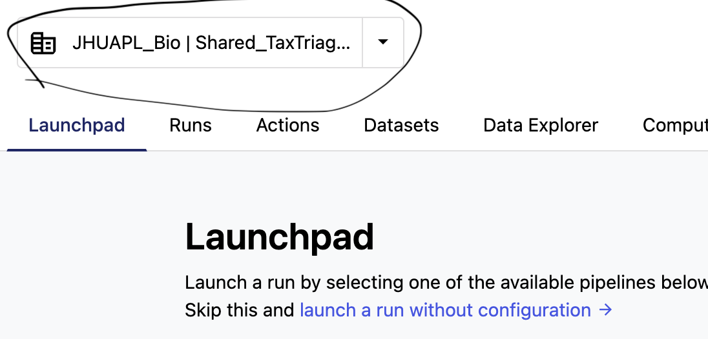
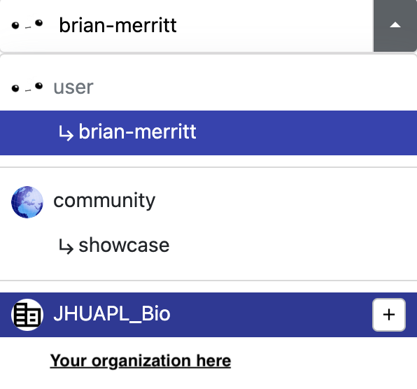

# Cloud & Seqera

TaxTriage can be run on AWS cloud infrastructure using [Nextflow Tower / Seqera](https://cloud.tower.nf/). This page covers setup, launching jobs, uploading data, and monitoring runs.

> ⚠️ Be aware of data sensitivity and compliance requirements before uploading sequencing data to cloud storage.

---

## Setup

### Step 1: Create a Seqera Account

1. Create an account at [cloud.tower.nf](https://cloud.tower.nf/)
2. Full documentation: [help.tower.nf](https://help.tower.nf/22.2/)

### Step 2: Request Access (JHU/APL Seqera Instance)

Send a request to **brian.merritt@jhuapl.edu** — you will receive credentials for the S3 buckets and the compute environment.

### Step 3: Set Up a Compute Environment

If using the JHU/APL-provided Seqera instance, the compute environment is pre-configured. For your own Seqera account, follow the [official compute environment docs](https://abhi18av.github.io/nf-tower-docs-orgs-and-teams/21.04.temp3/compute-envs/overview/) to connect your AWS account and configure billing.

> ⚠️ Ensure the compute environment matches the credentials you configured — mismatches cause job failures.


---

## Accessing the Launchpad

### 1. Select Your Organization

Click the dropdown near the top-left of Seqera and select your organization name. A "Shared" workspace is also available for all users of the TASS program.





### 2. Navigate to TaxTriage

On the JHU/APL instance, the pipeline is listed as **TASS**. It comes pre-loaded with default parameters for a quick test launch.


---

## Adding a Pipeline

If you need to add TaxTriage to your own Seqera launchpad:


---

## Launching a Job

### Configure Parameters

Expand the pipeline parameters in the launch interface. All parameters match the [CLI Parameters](cli-parameters.md) reference. For your own data, update all paths to point to your S3 bucket locations.


### Launch Options

**Option A — Direct Launch:**  
Click **Launch** to start immediately. You will be redirected to the running job list.

**Option B — Launch Settings:**  
Click **Launch Settings** to review the full JSON parameter set, change the Git branch, and customize the environment before submitting.

---

## Video Walkthroughs

### Launching from the Launchpad

The video below shows the default launchpad with pre-loaded inputs. Edit parameters as needed, then click Launch.

<video width="100%" controls>
  <source src="https://user-images.githubusercontent.com/50592701/192596313-7e30f285-dc1d-4c62-99d2-5791a5d8c0e9.webm" type="video/webm">
  <a href="https://user-images.githubusercontent.com/50592701/192596313-7e30f285-dc1d-4c62-99d2-5791a5d8c0e9.webm">View launch walkthrough video</a>
</video>

### Using Launch Settings

This video shows using **Launch Settings** to review the full parameter JSON, change the branch, and configure the environment before submitting.

<video width="100%" controls>
  <source src="https://user-images.githubusercontent.com/50592701/192596272-46007980-cc07-46c3-978f-e1846adbfffb.webm" type="video/webm">
  <a href="https://user-images.githubusercontent.com/50592701/192596272-46007980-cc07-46c3-978f-e1846adbfffb.webm">View launch settings video</a>
</video>

### Monitoring a Running Job

This video shows how to monitor module-level progress, view the Execution Log, and inspect individual step commands and outputs.

<video width="100%" controls>
  <source src="https://user-images.githubusercontent.com/50592701/192596324-57162d50-2738-4b7f-ba8c-2fa473ca1433.webm" type="video/webm">
  <a href="https://user-images.githubusercontent.com/50592701/192596324-57162d50-2738-4b7f-ba8c-2fa473ca1433.webm">View job monitoring video</a>
</video>

---

## Uploading Data to S3

All file paths in your samplesheet should be relative to your S3 bucket root. Full `s3://bucketname/...` URLs are not required inside samplesheet fields.

**Setup example:**


The example above shows an S3 bucket configured with the necessary permissions for Nextflow Tower. The directory mirrors the test data in the `examples/` folder of the repository.

**Example samplesheet with S3-relative paths:**

```
sample,platform,fastq_1,fastq_2,type
Sample_A,ILLUMINA,data/Sample_A_R1.fastq.gz,data/Sample_A_R2.fastq.gz,blood
```

### IAM Permissions

Your S3 bucket and compute environment must have the appropriate IAM permissions configured:


---

## S3 Bucket Example


---

## Monitoring Jobs

From within a running job you can:

- **View module status** — each step shows a running/complete/failed icon
- **Check Execution Log** — stdout/stderr streamed in real time
- **Inspect individual modules** — click any module name to see the exact command, resource usage, and log

### Relaunching a Failed Job

1. Click the three-dot menu (⋮) on the failed job
2. Select **Resume**
3. Update your samplesheet or parameters in S3 as needed
4. Click **Launch**

---

## Running Offline (Local Mode)

For air-gapped environments without internet access, see [Running the Pipeline → Offline Mode](running-the-pipeline.md#offline--no-internet-mode).

---

## Cost Considerations

- Most compute cost comes from Kraken2 classification and alignment steps
- `--low_memory` reduces RAM requirements but significantly increases runtime
- `--subsample <N>` reduces both cost and runtime
- `standard8` and `pluspf8` databases offer a good balance between sensitivity and memory cost
