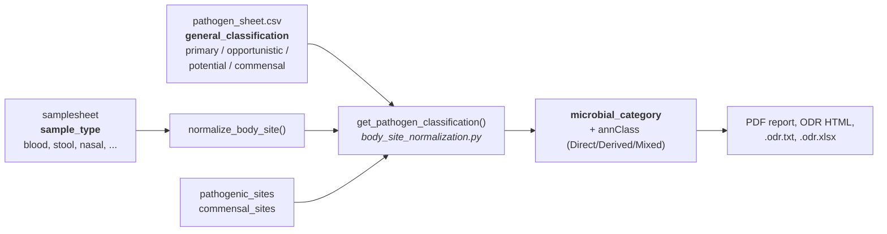
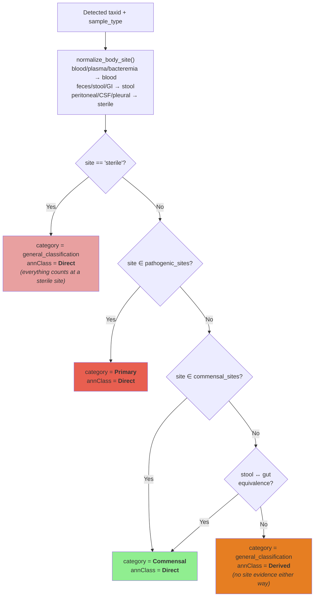
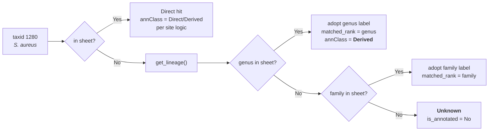
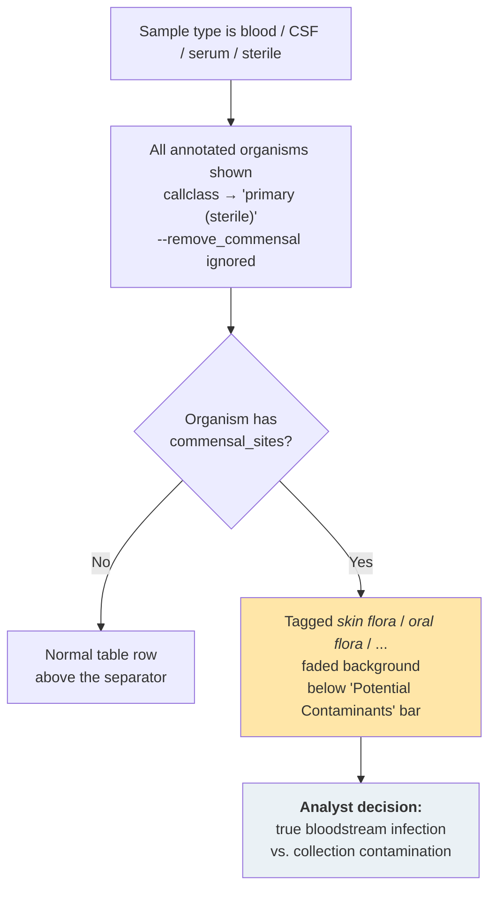
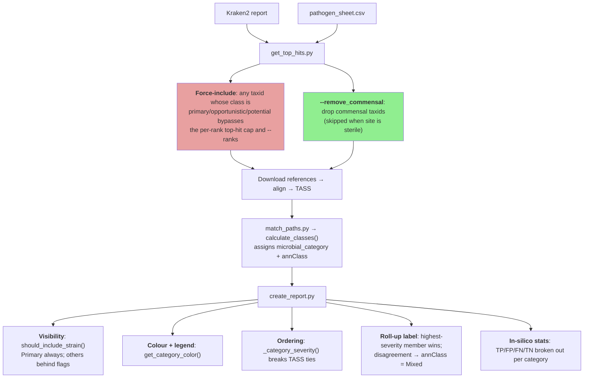

# Microbial Categories

Every organism TaxTriage reports carries a **microbial category**, which is one of `Primary`, `Opportunistic`, `Potential`, `Commensal`, or `Unknown`. The category is the pipeline's answer to _"if this organism is really here, does it matter?"_, and it is deliberately kept separate from [TASS](tass-scoring.md), which answers _"is this organism really here?"_

> **The single most important thing to know:** the category never changes the TASS score. TASS is computed from breadth, Gini, minhash, disparity and HMP components only. Category controls **visibility, colour, ordering and triage priority** in the report. A `Commensal` with TASS 0.95 is a confident detection of something usually unremarkable; a `Primary` with TASS 0.08 is a weak signal for something that would matter if real. Read both columns together, always.

---

## 1. Where categories come from

The base label lives in the `general_classification` column of the curated pathogen sheet ([`assets/pathogen_sheet.csv`](https://github.com/jhuapl-bio/taxtriage/blob/main/assets/pathogen_sheet.csv), or your own sheet via `--pathogens`). That base label is then **re-resolved at runtime against the sample's body site**, producing the `microbial_category` field you see in the report.

Three columns in the sheet drive this:

| Column                   | Role                                                                                             |
| ------------------------ | ------------------------------------------------------------------------------------------------ |
| `general_classification` | The default category, used when the sample site gives no better information                      |
| `pathogenic_sites`       | Sites where this organism causes disease; a hit at one of these sites is promoted to `Primary`   |
| `commensal_sites`        | Sites where this organism is normal flora; a hit at one of these sites is demoted to `Commensal` |

Current contents of the shipped sheet (1,702 rows):

| `general_classification` | Rows | Rows that also list `commensal_sites` |
| ------------------------ | ---- | ------------------------------------- |
| `potential`              | 557  | 46                                    |
| `opportunistic`          | 541  | 98                                    |
| `primary`                | 452  | 3                                     |
| `commensal`              | 152  | 143                                   |

---

## 2. The five categories

### Primary: _a recognised cause of disease in its own right_

An organism that causes disease in an immunocompetent host without needing a breach, a device, or immunosuppression. Finding it is meaningful regardless of how much of it there is. Examples: _Mycobacterium tuberculosis_, _Bacillus anthracis_, _Salmonella enterica_, _Neisseria meningitidis_, most reportable viruses.

- **Always shown** in the PDF. There is no `--show_primary` flag, because Primary is never hidden.
- Rendered **crimson** (`#E85F50`) when the sample site matches the organism's `pathogenic_sites` (`annClass = Direct`), and **orange** (`#E67E22`) when it is Primary only by general classification for a different site (`annClass = Derived`). The legend calls the orange case _"Primary Pathogen (Other Sample Type)"_.
- **Interpretation:** treat as actionable. If TASS is above the sample-type cutoff, this is your headline finding. If TASS is low, the organism still appears in the report. Check breadth of coverage and Gini before dismissing it, since Primary organisms at very low abundance are exactly the case TaxTriage is designed not to drop.

### Opportunistic: _causes disease given the right opening_

Pathogenic in a compromised host, at a normally sterile site, or in the presence of a device or wound, but frequently harmless elsewhere. Examples: _Pseudomonas aeruginosa_, _Candida albicans_, _Staphylococcus epidermidis_, _Enterococcus faecium_, _Acinetobacter baumannii_.

- Hidden by default; shown with `--show_opportunistics`.
- Rendered **pale amber** (`#ffe6a8`).
- 98 of the 541 opportunistic rows also carry `commensal_sites`, which is what lets the same organism read as "flora" in a stool sample and as "pathogen" in blood.
- **Interpretation:** the sample type is doing most of the work here. _S. epidermidis_ in blood at high TASS is either a real line infection or a skin-contamination event, and TaxTriage tags it `[skin flora]` so you know which possibility to weigh. The same organism in a skin swab is background.

### Potential: _reported in the literature, weak or context-dependent evidence_

The widest bucket (557 rows). These are organisms with published case reports or plausible pathogenic capacity but no established role as a routine agent of disease. The `status` column separates the evidence tiers: `established` (1,339 rows across all categories) vs. `putative` (363 rows).

- Hidden by default; shown with `--show_potentials`.
- Rendered **light blue** (`#ADD8E6`).
- **Interpretation:** hypothesis-generating, not conclusive. Useful when the Primary/Opportunistic tables come back empty and you need candidates. Cross-check `status`, the `reference` column, and the sample's clinical context before acting on one.

### Commensal: _normal flora at this site_

Organisms expected in a healthy microbiome at the sampled site. Examples: _Thomasclavelia ramosa_ (gut), _Cutibacterium acnes_ (skin), most oral _Streptococcus_ and _Veillonella_.

- Hidden by default; shown with `--show_commensals`.
- Rendered **light green** (`#90EE90`).
- Can be removed from the candidate list entirely before alignment with `--remove_commensal` (see §5).
- **Interpretation:** normally noise. But a commensal at high abundance in a _sterile_ sample is the opposite of noise. It is either a genuine translocation or infection, or a contamination event during collection. TaxTriage handles that case explicitly (§4).

### Unknown: _not in the sheet_

Anything detected that has no row in the pathogen sheet, and no annotated ancestor in its taxonomic lineage. `is_annotated = No`.

- Hidden by default; shown with `--show_unidentified`.
- Rendered **white**.
- **Interpretation:** absence of evidence. Environmental, database-artefact, or simply un-curated organisms all land here. A high-TASS `Unknown` with strong even coverage is worth looking up by hand, and it is also the entry point for [Novelty Detection](novelty-detection.md).

### Summary

| Category      | Sheet value     | Rows | Colour                      | Shown by default           | Severity rank | Reading                    |
| ------------- | --------------- | ---- | --------------------------- | -------------------------- | ------------- | -------------------------- |
| Primary       | `primary`       | 452  | 🟥 `#E85F50` / 🟧 `#E67E22` | ✅ always                  | 4             | Act on it                  |
| Opportunistic | `opportunistic` | 541  | 🟨 `#ffe6a8`                | ❌ `--show_opportunistics` | 3             | Depends on site & host     |
| Potential     | `potential`     | 557  | 🟦 `#ADD8E6`                | ❌ `--show_potentials`     | 2             | Investigate further        |
| Unknown       | _(absent)_      | —    | ⬜ `#FFFFFF`                | ❌ `--show_unidentified`   | 1             | Un-curated; check manually |
| Commensal     | `commensal`     | 152  | 🟩 `#90EE90`                | ❌ `--show_commensals`     | 0             | Expected background        |

The **severity rank** (`_category_severity()` in `create_report.py`) is what breaks ties when a species roll-up has to choose one label for several strains, and what orders rows within a table. Note that `Unknown` outranks `Commensal`, because an un-curated organism is treated as more interesting than a confirmed normal-flora one.

---

## 3. Site-aware resolution

This is the part that surprises people: **the same organism gets a different category in different samples.** `get_pathogen_classification()` applies the following, in order:

`annClass` is the provenance flag that tells you _how_ the category was reached:

| `annClass`  | Meaning                                                                                                             | How to read it                                                                       |
| ----------- | ------------------------------------------------------------------------------------------------------------------- | ------------------------------------------------------------------------------------ |
| **Direct**  | The sample site matched this organism's `pathogenic_sites` or `commensal_sites`                                     | Strongest annotation: the sheet has site-specific evidence for exactly this scenario |
| **Derived** | No site match; fell back to `general_classification`, or the label came from a _parent taxon_ via lineage traversal | Weaker: the label is about the organism in general, not about this body site         |
| **Mixed**   | A species/genus roll-up whose member strains resolved to more than one category                                     | Expand the group; the roll-up shows the highest-severity member                      |

### Lineage fallback

If a detected taxid has no row in the sheet, `calculate_classes()` walks up the NCBI lineage (species → genus → family → …) using the taxdump and adopts the first annotated ancestor's classification, recording `matched_taxid` and `matched_rank`. Anything annotated this way is `Derived`.

**Interpretation:** a `Primary` call with `matched_rank = genus` means _"something in this genus is a primary pathogen"_, not _"this species is"_. Check `matched_taxid` in the JSON/TSV before treating a Derived call as a species-level finding.

---

## 4. Sterile sites and the flora-contamination case

Two separate mechanisms handle sterile specimens, and they pull in opposite directions on purpose.

**Everything is pathogenic at a sterile site.** When the normalized sample type is `sterile` (peritoneal, pleural, synovial, CSF, and friends), `match_paths.py` rewrites every sheet entry's `callclass` to `primary (sterile)`, and `should_include_strain()` shows _any_ annotated organism regardless of category. Nothing is supposed to be growing there, so nothing is filtered out. `--remove_commensal` is also disabled for sterile sites.

**But flora at a sterile site is flagged as a likely contaminant.** For sterile-adjacent types (`sterile`, `blood`, `csf`, `serum`), any organism carrying `commensal_sites` gets:

- an inline orange tag next to its name, e.g. `Staphylococcus epidermidis [skin flora]`
- a faded row background
- placement below a **"Potential Contaminants"** separator bar in the table

**Interpretation:** the tag is not a verdict. A single skin organism at low abundance in one of two blood draws reads as contamination; the same organism at high TASS with even coverage, or matching a device-infection picture, reads as real. TaxTriage shows it and lets you decide; it does not suppress it.

---

## 5. Where categories act in the pipeline

### Body-site pre-filtering in `get_top_hits.py`

Before any alignment happens, the sheet is filtered to rows whose `pathogenic_sites` include the sample's site, so a nasal sample doesn't force-include the entire gut pathogen list. If that filter returns **zero** rows (typical for `environmental` samples, which have no site column), the pipeline falls back to `general_classification` with no site restriction rather than silently dropping everything.

### Flags that control category behaviour

| Flag                    | Effect                                                                                        |
| ----------------------- | --------------------------------------------------------------------------------------------- |
| `--show_opportunistics` | Show Opportunistic rows in the PDF                                                            |
| `--show_potentials`     | Show Potential rows in the PDF                                                                |
| `--show_commensals`     | Show Commensal rows in the PDF                                                                |
| `--show_unidentified`   | Show Unknown (un-annotated) rows in the PDF                                                   |
| `--remove_commensal`    | Drop commensal taxids from candidates _before_ download/alignment (ignored for sterile sites) |
| `--pathogens <path>`    | Use a custom sheet with your own `general_classification` values                              |

Hidden categories are listed by name in the report legend so a reader knows what was suppressed. **Nothing is ever hidden from the tabular outputs**: `<sample>.odr.txt` and `<sample>.odr.xlsx` always contain every organism in every category, regardless of the flags. If a category is missing from the PDF, it is still in the spreadsheet.

`make_report.py` accepts `--microbial_category` to filter aggregated multi-sample reports to a subset of categories (or `all`).

### High-consequence overrides everything

The separate `high_consequence` column (179 of 1,702 rows: select agents, category A/B threats) forces an organism into the PDF **regardless of category visibility flags or TASS cutoff**. It works independently of the category axis, so a high-consequence organism can be any category and is never suppressed.

---

## 6. Worked examples

| Organism                     | `general_classification` | `pathogenic_sites` | `commensal_sites` | Sample type | Resolved category                              | `annClass` | Why                                                          |
| ---------------------------- | ------------------------ | ------------------ | ----------------- | ----------- | ---------------------------------------------- | ---------- | ------------------------------------------------------------ |
| _Salmonella enterica_        | `primary`                | `stool, blood`     | —                 | stool       | **Primary**                                    | Direct     | Site matches `pathogenic_sites`                              |
| _Salmonella enterica_        | `primary`                | `stool, blood`     | —                 | nasal       | **Primary**                                    | Derived    | No site evidence; general class applies                      |
| _Cutibacterium acnes_        | `commensal`              | `blood`            | `skin`            | skin        | **Commensal**                                  | Direct     | Site matches `commensal_sites`                               |
| _Cutibacterium acnes_        | `commensal`              | `blood`            | `skin`            | blood       | **Primary (sterile-ish)** + `[skin flora]` tag | Direct     | Sterile-site rule promotes; flora tag warns of contamination |
| _Thomasclavelia ramosa_      | `commensal`              | `blood`            | `gut, stool`      | stool       | **Commensal**                                  | Direct     | gut↔stool equivalence                                       |
| _Escherichia coli_           | `opportunistic`          | `urine, blood`     | `gut`             | urine       | **Primary**                                    | Direct     | `pathogenic_sites` match promotes to Primary                 |
| _Escherichia coli_           | `opportunistic`          | `urine, blood`     | `gut`             | stool       | **Commensal**                                  | Direct     | gut↔stool equivalence demotes                               |
| Un-curated _Rhodococcus_ sp. | _(absent)_               | —                  | —                 | sputum      | **Opportunistic**                              | Derived    | Genus row matched via lineage walk                           |
| Un-curated environmental sp. | _(absent)_               | —                  | —                 | any         | **Unknown**                                    | Direct     | No row, no annotated ancestor                                |

---

## 7. Reading a report by category

A practical triage order for the PDF and the [Interactive Report](interactive-report.md):

1. **High-consequence rows first**, whatever their category or score.
2. **Primary + Direct (crimson)** above the sample-type TASS cutoff. These are the headline findings.
3. **Primary + Derived (orange)**: real pathogens, but annotated for a different body site. Ask whether the site makes sense.
4. **Opportunistic**, weighted by the sample type and what you know about the host.
5. **Anything under the "Potential Contaminants" separator**: flora at a sterile site. Adjudicate with abundance, coverage evenness, and replicate draws.
6. **Potential / Unknown**: only when the above is empty or the clinical picture is unresolved.

Two failure modes worth naming:

- **Reading category as confidence.** It isn't. Sort by TASS _within_ a category, not across categories.
- **Reading Derived as species-specific.** Check `matched_rank`, because a genus-level match says much less than a species-level one.

---

## 8. Curating categories

To change how an organism is categorised, edit the sheet. No code change is needed. See [Contributing](contributing.md#adding-organisms-to-the-pathogen-sheet).

- Set `general_classification` to exactly one of `primary`, `opportunistic`, `potential`, `commensal` (lowercase in the sheet; the pipeline capitalises it). Unrecognised values normalise to `Unknown`.
- Prefer adding `pathogenic_sites` / `commensal_sites` over changing `general_classification`. Site columns make the annotation conditional and correct across sample types; changing the general class changes it everywhere.
- Use `status` (`established` vs. `putative`) to record evidence strength, especially for `potential` rows.
- Reserve `high_consequence = TRUE` for organisms that must never be filtered out.
- Site values are normalised on load, so synonyms (`feces`/`stool`, `bacteremia`/`blood`, `pleural fluid`/`sterile`) are accepted.

To propose changes to the shipped sheet, open a GitHub issue.

---

## Further Reading

- [Output](output.md#pathogen-sheet): pathogen-sheet columns and report file layout
- [TASS Scoring](tass-scoring.md): the confidence axis, which is independent of category
- [CLI Parameters](cli-parameters.md#pathogen-discovery-and-reporting-filters): `--show_*`, `--remove_commensal`, `--pathogens`
- [Interactive Report](interactive-report.md): category filters and colouring in the HTML report
- [Novelty Detection](novelty-detection.md): what happens to high-signal `Unknown` organisms
- [Contributing](contributing.md#adding-organisms-to-the-pathogen-sheet): adding or re-categorising organisms
