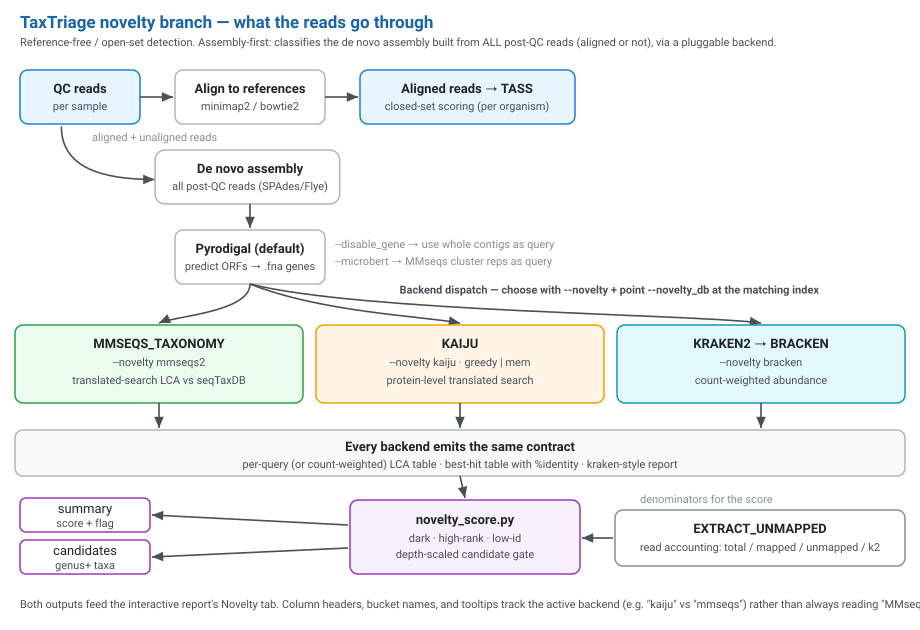
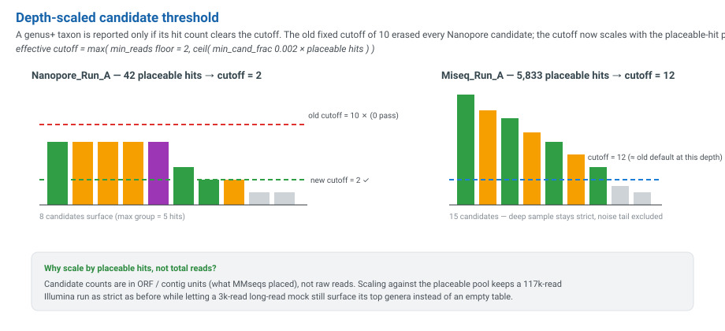
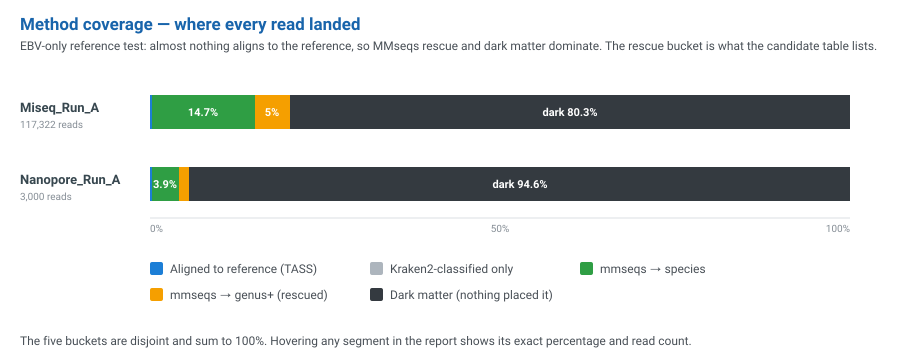
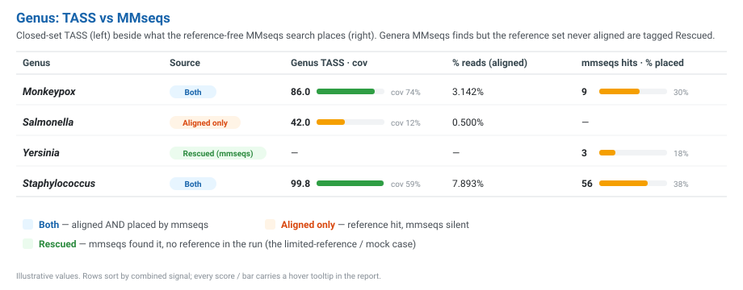

# Novelty Detection (Reference-Free / Open-Set)

TaxTriage's closed-set core scores organisms against the references you pull into the run (see [TASS Scoring](tass-scoring.md)). But a sample almost always contains reads that align to **no** reference, either because the right genome was never in the panel or because the organism is too divergent to match one. The reads left over after alignment are called the **residual**, and the **novelty branch** characterises it. It tells you *how much* of the sample is unexplained and *what taxa* a reference-free translated search can still place, down to the genus-or-higher level.

This is exactly the situation in a limited-reference or mock run, for example when you align only against EBV genomes but the sample contains many other genera. The closed-set table will be nearly empty, but the novelty branch (backed by a broad database such as Kalamari) recovers the higher-rank signal.

> Enable it by choosing a backend: `--novelty mmseqs2`, `--novelty kaiju`, or `--novelty bracken` (default `false` = off). It never changes the TASS scores themselves; it is an additional, complementary view.

---

## How It Works



The branch is **assembly-first with a pluggable backend** (`subworkflows/local/novelty.nf`). It classifies the **de novo assembly built from all post-QC reads**, which is the same set of contigs handed to the annotation branch, rather than only the unmapped residual. This means the search can report organisms that *did* align to a pulled reference (e.g. targeted Ebola) alongside anything novel. By default a Pyrodigal ORF-prediction step runs first and the backends classify the **predicted genes** (see [Gene mode](#gene-mode-default-on)); pass `--disable_gene` to classify the whole contigs directly instead.

1. **Account for the reads.** `EXTRACT_UNMAPPED` computes the per-sample denominators the score needs: total, reference-aligned, reference-unaligned, and kraken2-classified counts. (It does not extract a read stream for taxonomy; the assembly is the query.)
2. **Pick the query.** By default Pyrodigal-predicted genes from the de novo contigs are the query. With `--disable_gene`, the whole contigs are used instead. With `--microbert`, the shared MicrobeRT cluster representatives are used. Either way the query is nucleotide FASTA, so the same backends apply.
3. **Classify with the chosen backend** (see [Backends](#backends) below). Each backend emits the same contract: a per-query (or count-weighted) LCA table, an optional best-hit table with % identity, and a kraken-style report.
4. **Score and shortlist.** `bin/novelty_score.py` turns the backend output into a **per-sample summary** (a novelty score, a flag, and a read-accounting breakdown) and a **candidate list** (the genus-or-higher taxa with enough support to report). It reads `params.novelty` to know whether the LCA carries a count column (bracken) or one row per query (kaiju / mmseqs2).

The collector `bin/novelty_collect.py` merges every sample's summary + candidates into `report/all.novelty.json` (plus per-sample JSON/XLSX), which the interactive report reads to build the **Novelty** tab. Throughout the report, column headers, bucket names, and tooltips track the active backend (e.g. "kaiju" vs "mmseqs") rather than always reading "MMseqs".

### Backends

Choose with `--novelty` and point `--novelty_db` at the matching database. All three classify the de novo contigs:

| `--novelty` | Tool & method | `--novelty_db` accepts | DB cache |
|---|---|---|---|
| `mmseqs2` | `MMSEQS_TAXONOMY`, a translated-search LCA (MMseqs extracts ORFs from the contigs internally). | MMseqs seqTaxDB **name** (e.g. `Kalamari`, `UniProtKB`) or a local seqTaxDB directory. | `--novelty_db_cache` (default `dbs/mmseqs`) |
| `kaiju` | `KAIJU`, a protein-level translated search (self-translates the contigs). Run mode is `greedy` or `mem` via `--novelty_kaiju_mode`. | A kaiju index **alias** (`test`, `viruses`/`viral`, `nr`, `nr_euk`, `refseq`, `refseq_nr`, `refseq_ref`, `progenomes`, `fungi`, `plasmids`, `rvdb`), an exact `*.tgz`, a URL, or a local dir. | `--novelty_kaiju_db_cache` (default `dbs/kaiju`) |
| `bracken` | `KRAKEN2_NOVELTY` → `BRACKEN`, meaning kraken2 over the contigs, then bracken re-estimates count-weighted abundance. | A kraken2/bracken index **alias** (`standard`/`standard_8gb`/`standard_16gb`, `viral`, `minusb`, `pluspf[_8gb\|_16gb]`, `pluspfp[_8gb\|_16gb]`, `core_nt`, `gtdb`, `eupathdb`, `ncbi_reference`; `k2_` prefix optional), an exact `*.tar.gz`, a URL, or a local dir. | `--novelty_kraken2_db_cache` (default `dbs/kraken2`) |

Aliases are auto-downloaded from the configured buckets (`--novelty_kaiju_db_baseurl`, `--novelty_kraken2_db_baseurl`) into the per-backend `storeDir` cache so they persist and are reused across runs. The kaiju `test` alias is a tiny git-LFS-hosted index for CI and `-profile test`. It is *not* cached to `dbs/`; it lives in `work/` like any other test download. The bracken backend additionally honours `--novelty_bracken_readlen` (default `100`, the kmer-distribution read length) and `--novelty_bracken_level` (default `S` = species).

#### Kaiju run mode (`--novelty_kaiju_mode`)

Kaiju can be run two ways, and the choice changes how divergent or conserved contigs resolve:

| Mode | Kaiju flags | Behaviour |
|---|---|---|
| `greedy` *(default)* | `-a greedy -e 5` | Allows up to 5 substitutions and picks a nearest-neighbour match even on **divergent** contigs. More sensitive, and better at placing genuinely novel sequence, at the cost of occasional over-reach. |
| `mem` | `-a mem` | Exact maximum-exact-matches only (no `-e`). Avoids long **conserved** contigs collapsing to a coarse genus-level LCA on tied protein matches. More conservative/precise. |

If a run reports surprisingly coarse (genus-only) calls on contigs you expect to resolve to species, try `--novelty_kaiju_mode mem`; if novel contigs are going dark, `greedy` is the more sensitive choice.

#### Gene mode (default on)

By default Pyrodigal predicts ORFs on the contigs first and the predicted nucleotide CDS (`.fna`) become the per-query unit for every backend. One near-complete genome contig then contributes **several LCA rows** (one per gene) instead of one. That is closer to a per-gene BLAST view, and it suits the count-based novelty score better because it produces more, finer-grained counts. Pass `--disable_gene` to skip Pyrodigal and feed the **whole contigs** directly (one query per contig), trading granularity for a little less runtime. The summary TSV records which mode produced the row in its `gene_mode` column (`1` = genes, the default; `0` = contigs), and the interactive report's Novelty tab labels its count unit accordingly: **"genes"/"seqs"** by default, **"contigs"/"ctgs"** under `--disable_gene` (and always **"reads"** for the bracken backend).

> Negative controls are skipped by the novelty branch, because a flagged control is a process signal rather than a call about a sample.

> **VF/AMR for unaligned samples.** When `--annotate` is also set, samples that assembled contigs but aligned no reference now carry their VF/AMR annotation into the Summary and VF/AMR views (not just the Novelty tab). See [Detection Rescue → Annotation of unaligned samples](detection-rescue.md#annotation-of-unaligned-samples).

### The novelty score

The summary score is a weighted sum of three z-scored signals (weights set by `--novelty_weights`, default `0.5,0.3,0.2`):

| Signal | Meaning |
|---|---|
| `dark_fraction` | Reads explained by **nothing**: not kraken2-classified, not reference-aligned, not MMseqs-placed. The core "unknown" mass. |
| `highrank_only_fraction` | Reads MMseqs could place, but only at **genus or higher** (no species call). This is the hallmark of a divergent or missing-reference organism. |
| `lowident_tail_mass` | Fraction of best hits below the amino-acid identity cutoff (`--novelty_idnt_cut`, default 50%). |

A sample is **flagged** when the score crosses `--novelty_flag_z` (default 2.0, i.e. ~2σ above the run baseline).

---

## Candidate Taxa: the Depth-Scaled Threshold

A genus+ taxon is only listed as a candidate if its hit count clears a cutoff. Originally this was a **fixed count of 10**, which silently erased every candidate for shallow or long-read samples. In those samples the residual ORF counts are small, so even the strongest genus might hold only a handful of hits.

The cutoff now **scales with the placeable-hit pool**:

```
effective cutoff = max( min_reads floor,  ceil( min_cand_frac × placeable_hits ) )
```

with `min_reads = 2` (the top-level `--novelty_min_reads`) and `min_cand_frac = 0.002` by default. The denominator is the number of genus+ (placeable) hits in that sample, **not** total reads, because candidate counts are in ORF/contig units rather than raw reads. Setting `--novelty_min_reads 1` surfaces single-contig hits (useful for deep dilutions that assemble to ~1 viral contig) and also **disables** the depth-scaled cutoff entirely.



The effect: a deep 117k-read Illumina sample keeps an effective cutoff of ~12 (about the same strictness as the old default at that depth), while a 3k-read long-read mock, whose top genus holds only 5 ORFs, drops to a cutoff of 2 and shows its candidates instead of an empty table.

> **Long reads are not the cause of an empty candidate table. Low residual depth is.** A small ONT/PacBio sample and a small Illumina sample behave identically here; what matters is how many ORFs the residual produced.

Each candidate row carries:

| Column | Meaning |
|---|---|
| `reads` | Hit count at this taxon (ORF/contig units). |
| `frac_of_sample` | Share of total sample reads (small for ORF-level counting; kept for continuity). |
| `frac_of_highrank` | Share of all placeable genus+ hits. This is the honest "how dominant is this genus among what MMseqs placed" number that the comparison views key on. |

### Domain vs. superkingdom

NCBI's 2024 taxonomy renamed the top rank `superkingdom` → `domain`. The scorer counts **both**, so domain-level placements (e.g. `Bacteria`) are no longer dropped from the candidate list or from `highrank_only_fraction`.

---

## The Novelty Tab in the Interactive Report

The [Interactive Report](interactive-report.md) gains a **Novelty** tab (visible whenever `--novelty` produced data) with three linked views.

### 1. Per-sample novelty summary

One row per sample with the score, the flag, and inline bars for `dark_fraction`, `highrank_only_fraction`, and the identity tail. Flagged samples are highlighted.

### 2. Method coverage: "where every read landed"

A per-sample stacked bar that accounts for the whole sample across five **disjoint** buckets that sum to 100%:



| Bucket | Colour | Meaning |
|---|---|---|
| Aligned to reference (TASS) | blue | Reads that mapped to a pulled reference. This is the closed-set TASS basis. |
| Kraken2-classified only | grey | Classified by kraken2 but not aligned and not MMseqs-placed (known taxon, no reference in the run). |
| MMseqs → species | green | Residual reads/ORFs placed at species-or-finer. |
| MMseqs → genus+ (rescued) | orange | Residual placed only above species. This is the rescue bucket the candidate table lists. |
| Dark matter | near-black | Explained by nothing. |

This is the direct answer to "what fraction was **hit** by alignment/TASS vs. what was **rescued** by MMseqs vs. what stayed dark." All samples render together so you can compare, e.g., an Illumina run against a Nanopore run side by side. Hover any segment for its exact percentage and read count.

### 3. Genus: TASS vs MMseqs

A genus-by-genus cross-check joining the closed-set TASS rollup with the MMseqs placements for the selected sample:



Each genus is tagged by where the evidence comes from:

- **Both**: aligned to a reference *and* placed by MMseqs.
- **Aligned only**: a reference hit, but MMseqs placed nothing there.
- **Rescued (mmseqs)**: MMseqs found it but the reference set never aligned it. This is the limited-reference / mock case made explicit: e.g. *Monkeypox* at TASS 86 with 74% coverage on the left, versus its MMseqs placement share on the right.

Sparkbars and hover tooltips appear throughout. A toggle in the tab switches between **Method coverage** and **Genus: TASS vs MMseqs**.

---

## Interpreting the Outputs

Whichever backend you pick, scoring is identical, so the artifacts read the same way. The two per-sample TSVs are the source of truth; the report just visualises them.

### `novelty/<sample>.novelty.summary.tsv`: one row per sample

| Column | How to read it |
|---|---|
| `sample` | Sample id. |
| `classifier` | Backend that produced the row (`mmseqs2`, `kaiju`, or `bracken`). Report headers and tooltips track this name. |
| `gene_mode` | `1` = Pyrodigal predicted-gene queries (the default), `0` = whole contigs were classified (`--disable_gene`). |
| `total_reads` | Denominator for every fraction below. |
| `dark_fraction` | Share of reads explained by **nothing** (not aligned, not kraken2-classified, not placed). High → genuine dark matter / missing reference. |
| `highrank_only_fraction` | Share the backend could place, but only at **genus or higher**. The hallmark of a divergent or absent-reference organism. |
| `lowident_tail_mass` | Share of best hits below `--novelty_idnt_cut`. High → weak, distant protein matches. |
| `z_dark`, `z_highrank`, `z_lowident` | Each raw signal as a z-score against the run baseline. |
| `novelty_score` | Weighted sum of the three z-scores (`--novelty_weights`). |
| `novelty_flag` | `1` when `novelty_score` ≥ `--novelty_flag_z` (default 2.0). |
| `ref_aligned`, `k2_classified`, `mmseqs_assigned` | Read/contig counts behind the method-coverage buckets. `mmseqs_assigned` is the backend's total placed count regardless of which tool ran. |
| `mmseqs_assigned_species`, `mmseqs_assigned_highrank` | Of the placed count, how many resolved to species vs. genus+ only. |
| `ref_aligned_frac`, `k2_frac`, `mmseqs_frac` | The same as fractions of `total_reads`. |

A useful first read: **a high `novelty_flag` with a high `highrank_only_fraction` and a populated candidate table = a real organism the reference panel missed.** A high flag driven mostly by `dark_fraction` with an empty candidate table = unplaceable dark matter, or simply too little residual depth (see Troubleshooting).

### `novelty/<sample>.novelty.candidates.tsv`: the genus+ shortlist

The taxa that cleared the candidate gate, each carrying `reads` (hit count in ORF/contig units), `frac_of_sample`, and `frac_of_highrank` (share of all placeable genus+ hits, which is the column the comparison views key on). For kaiju and mmseqs2 a "read" here is one contig/gene query; for bracken it is a bracken-estimated read count. Counts are small by nature (a residual rarely assembles many contigs), so judge dominance by `frac_of_highrank`, not raw `reads`.

> **Backend differences worth knowing.** `mmseqs2` reports an amino-acid `pident` per best hit, so `lowident_tail_mass` and `--novelty_idnt_cut` are most meaningful there. `kaiju` emits one LCA row per query (no count column); its resolution depends on `--novelty_kaiju_mode`. `bracken` carries a real count column and re-estimates abundance, so its candidate counts are read-weighted rather than one-per-contig.

## Downloads

The Novelty tab links the raw artifacts, all written to `report/`:

| File | Contents |
|---|---|
| `all.novelty.json` | Combined feed (all samples) the report is built from. |
| `all.novelty.xlsx` | Combined workbook: Summary + Candidates sheets. |
| `<sample>.novelty.json` / `.xlsx` | Per-sample summary + candidates. |
| `novelty/<sample>.novelty.summary.tsv` | Per-sample score + read-accounting columns. |
| `novelty/<sample>.novelty.candidates.tsv` | Per-sample genus+ candidate taxa. |

---

## Parameters

See [CLI Parameters → Novelty Detection](cli-parameters.md#novelty-detection-reference-free--open-set) for the full table. The essentials:

| Parameter | Default | Purpose |
|---|---|---|
| `--novelty` | `false` | Master switch **and** backend selector: `mmseqs2`, `kaiju`, or `bracken`. |
| `--disable_gene` | `false` | Skip the default Pyrodigal step and classify the whole contigs instead of predicted genes. See [Gene mode](#gene-mode-default-on). |
| `--novelty_db` | `Kalamari` | Database for the chosen backend, given as a name/alias (auto-downloaded) or a local path. See the [Backends](#backends) table for what each accepts. |
| `--novelty_db_cache` | `dbs/mmseqs` | `storeDir` cache for the mmseqs2 download. |
| `--novelty_kaiju_db_cache` | `dbs/kaiju` | `storeDir` cache for the kaiju download. |
| `--novelty_kraken2_db_cache` | `dbs/kraken2` | `storeDir` cache for the bracken/kraken2 download. |
| `--novelty_kaiju_db_baseurl` | kaiju S3 bucket | Index bucket kaiju aliases are fetched from. |
| `--novelty_kraken2_db_baseurl` | genome-idx S3 bucket | Index bucket kraken2/bracken aliases are fetched from. |
| `--novelty_kaiju_mode` | `greedy` | Kaiju run mode: `greedy` (sensitive) or `mem` (precise). See [Kaiju run mode](#kaiju-run-mode---novelty_kaiju_mode). |
| `--use_denovo` | `false` | Build the de novo assembly the novelty branch classifies. |
| `--novelty_weights` | `0.5,0.3,0.2` | `w_dark,w_rank,w_idnt` for the novelty score. |
| `--novelty_flag_z` | `2.0` | Score threshold for flagging a sample. |
| `--novelty_idnt_cut` | `50.0` | Amino-acid % identity below which a hit counts toward the low-identity tail (mmseqs2 pident). |
| `--novelty_min_reads` | `2` | Candidate floor: min hits to report a taxon (contigs for kaiju/mmseqs2, reads for bracken). `1` disables the depth-scaled cutoff. |
| `--novelty_bracken_readlen` | `100` | bracken `-r` read length (kmer distribution to use). |
| `--novelty_bracken_level` | `S` | bracken `-l` rank level (S = species). |

The lower bound of the candidate gate is the top-level `--novelty_min_reads` (passed straight through by the `NOVELTY_SCORE` module). The depth-scaling fraction (`--min-cand-frac`, default `0.002`) is a `novelty_score.py` default and is not exposed as a pipeline flag; the module forces it to `0` (disabling depth scaling) whenever `--novelty_min_reads ≤ 1`. To use a different fraction, edit the module/script. For very shallow residuals, prefer `--novelty_min_reads 1`.

### Example

This mirrors the EBV novelty run: align only against EBV, classify the contigs with kaiju, and annotate.

```bash
nextflow run main.nf -profile test,docker -resume \
  --input ebv/1/temp_samplesheet.csv \
  --db /path/to/k2_pluspfp_08gb \
  --outdir ebv/1/ttoutput \
  --remove_taxids '9606 3052458' \
  --organisms '3052462 3052460 186538' \
  --max_memory 12GB \
  --skip_kraken2 \
  --novelty kaiju \
  --novelty_db ~/databases/kaiju/kaiju_db_viruses_2024-08-15 \
  --use_denovo \
  --annotate
```

Aligning only against EBV means the closed-set table is sparse, while the novelty branch recovers the higher-rank genera present in the sample. This is exactly the scenario the Method-coverage and Genus comparison views were designed to make legible. Swap `--novelty kaiju` for `mmseqs2` or `bracken` (with a matching `--novelty_db`) to change backend.

---

## Troubleshooting

**A sample is flagged as novel but its candidate table is empty.** It is below the depth where any genus clears the candidate cutoff. Confirm by checking `novelty/<sample>/<sample>.novelty_lca.tsv`: if it has genus+ rows but the candidate TSV is header-only, the residual is simply too shallow. The depth-scaled cutoff mitigates this; for very small residuals you can lower `--min-cand-frac` / `--min-reads` via the module args.

**The Novelty tab is blank on click.** The report draws each tab lazily. If you ever see an empty pane, hard-refresh the page (`Cmd/Ctrl+Shift+R`), because `file://` pages can cache an older copy. Any genuine render error now prints a red message in the pane rather than leaving it silently empty.

---

*See also: [Interactive Report](interactive-report.md) · [TASS Scoring](tass-scoring.md) · [Output](output.md) · [CLI Parameters](cli-parameters.md)*
