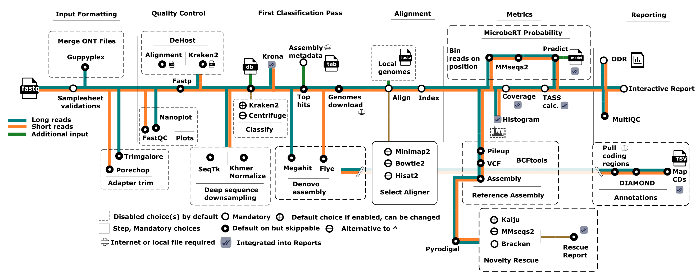
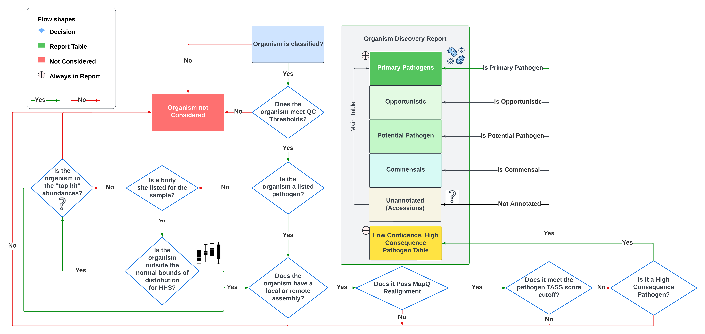

# Pipeline Modules

This page describes each step in the TaxTriage workflow in execution order — what it does, which tool is used, and what it produces.



---

## Step −1: SRA / ENA Retrieval (Optional)

**Modules:** `SRA_RESOLVE`, `SRA_FETCH_ENA`, `SRA_FETCH_SRATOOLS`
**Trigger:** any `fastq_1` value (samplesheet column or `--fastq_1`) that is an accession rather than a path

Runs before everything else, only when accessions are present.

1. `SRA_RESOLVE` batches every accession into one lookup against the ENA Portal API (falling back to NCBI eutils), expanding experiment/sample/project accessions into their child runs and recording each run's FASTQ URLs, md5s, instrument platform and paired-end layout.
2. `SRA_FETCH_ENA` downloads ENA's pre-split `fastq.gz` files and verifies them against the published md5.
3. `SRA_FETCH_SRATOOLS` handles runs ENA does not host, via `prefetch` + `fasterq-dump --split-3`.

Downloaded reads enter the pipeline as ordinary samples, so every step below is unchanged. Files are cached under `<outdir>/sra_downloads/` (or `--sra_cache_dir`) and reused on later runs instead of being downloaded again.

See [Samplesheet → SRA / ENA Accessions](samplesheet.md#sra--ena-accessions).

---

## Step 0: Pre-Aligned Input Preparation (Optional)

**Modules:** `PREPARE_BAM`, `BAM_CONSENSUS`
**Trigger:** any `bam` value (samplesheet column or `--bam`)

Runs in place of read processing, only for samples that arrive pre-aligned.

1. `PREPARE_BAM` normalises the container to BAM (CRAM is decoded, SAM is compressed, BAM is left alone), coordinate-sorts it unless the `@HD SO:` header already says it is sorted, writes a `.csi` index, and emits a primary-read count. `--bam_minmapq` applies a `samtools view -q` filter here if you asked for one.
2. `BAM_CONSENSUS` runs only when no `--reference_fasta` was supplied, calling `samtools consensus -a` off the alignment so sourmash sketching, the shared-window conflict report and the ANI matrix have bases to work with. References whose consensus is almost entirely `N` are dropped.

The resulting `[meta, bam, csi]` tuple has the same shape as the aligner's own output, so everything downstream is unchanged. A recovered consensus FASTA is fuzzy-matched against the assembly summary exactly like a user-supplied reference, producing the accession → taxid map `match_paths.py` needs.

Pre-aligned samples skip Steps 1 through 5 entirely and are excluded from reference download.

See [Pre-Aligned Input](pre-aligned-input.md).

---

## Step 0: Subsampling (Optional)

**Tool:** Khmer Normalization or Seqtk
**Parameter:** `--downsample` (Khmer) or `--subsample <N>` (Seqtk)

Reduces each sample to N reads before any downstream processing. Useful for a fast "triage" analysis when input datasets are very large.

---

## Step 1: Quality Control — Part 1

### Illumina
**Tool:** FastQC, fastp  
**Parameter:** `--minq 20` (default), `--skip_fastp`

Generates quality score distributions, adapter content plots, and per-base quality reports. Fastp filters low-quality reads based on `--minq`.

### Oxford Nanopore
**Tool:** pycoQC (requires `--sequencing_summary`) for Illumina, NanoPlot for ONT

Generates read length/quality plots from raw ONT output. NanoPlot is run on the raw reads. pycoQC uses the sequencing summary file for additional detail.

---

## Step 2: Adapter Trimming

### Illumina
**Tool:** Trimgalore  
**Parameter:** `--trim`

Removes adapter sequences from paired or single-end Illumina reads.

### Oxford Nanopore
**Tool:** Porechop  
**Parameter:** `--trim`

Removes adapter sequences from ONT reads.

---

## Step 3: Host Removal (Optional)

**Tool:** Minimap2 or Kraken2 (with `--filter_kraken2`)
**Parameters:** `--genome`, `--remove_reference_file`, `--min_mapq_host`, `--filter_kraken2 <k2_db>`

Reads that align to the host reference (e.g., human genome) are removed. Unclassified (non-host) reads are retained for classification.

> Studies show Minimap2 has a slightly lower false-negative rate than Bowtie2 for host depletion. See [PMC9040843](https://www.ncbi.nlm.nih.gov/pmc/articles/PMC9040843/) and [s41467-021-26865-w](https://www.nature.com/articles/s41467-021-26865-w).

---

## Step 4: Metagenomics Classification

**Tool:** Kraken2 (default) or Centrifuge  
**Parameters:** `--db`, `--k2_confidence`, `--skip_kraken2`, `--centrifuge`

Each read is classified against the Kraken2 (or Centrifuge) database. Results are summarized in a Kraken2 report and visualized as interactive Krona plots — the most important early output for understanding abundance from a metagenomics perspective.

> ⚠️ Always consider the limitations of your database. Organisms absent from the database cannot be classified. See [available databases](cli-parameters.md#supported-downloadable-databases).

---

## Step 5: Top Hits Assignment

**Parameters:** `--top_hits_count`, `--top_per_taxa`, `--pathogens`, `--add_irregular_top_hits`

Not all classified organisms are aligned — only "top hits" proceed to alignment. The selection follows this decision tree:



Top hits include:
- Any organism annotated in the [pathogen sheet](https://github.com/jhuapl-bio/taxtriage/blob/main/assets/pathogen_sheet.csv) (regardless of abundance)
- The top N organisms per taxonomic rank (controlled by `--top_hits_count` and `--top_per_taxa`)
- Organisms with irregular HMP abundance distributions (if `--add_irregular_top_hits` is set)

---

## Step 6: Reference Preparation

**Parameters:** `--assembly`, `--reference_fasta`, `--organisms`

Reference genomes for all top hit organisms are obtained:
- **Default (internet):** Downloaded from NCBI FTP using the assembly summary file.
- **Offline:** Provided via `--reference_fasta` (local FASTA) or `--assembly` (local assembly summary).

Which assembly is chosen per organism follows the [Assembly Selection Order](cli-parameters.md#assembly-selection-order): a curated `assembly_accession` from the pathogen sheet is used first (accession-first), otherwise the best local taxid match is picked by priority tier (representative → reference → complete genome → other), preferring RefSeq over GenBank on ties.

A FASTA index is built for Bowtie2 (Illumina) at this stage.

---

## Step 7: Alignment

### Illumina
**Tool:** Minimap2 (default), Hisat2, Bowtie2 (with `--use_bt2`)

### ONT / PacBio
**Tool:** Minimap2

All Kraken2-classified reads (or all raw reads if `--skip_kraken2`) are aligned to the reference genomes. Only the best-scoring alignment per read is currently retained.

> Note: Minimap2 is used for both data types in the host removal step, but BWA-MEM2/Bowtie2 is used for Illumina in the classification alignment step, as Minimap2 underperforms for Illumina metagenomics alignments ([PMC9040843](https://www.ncbi.nlm.nih.gov/pmc/articles/PMC9040843/)).

---

## Step 8: Alignment Statistics

**Tool:** samtools  
**Output:** `samtools/<sample>.txt` (coverage), `samtools/<sample>.tsv` (depth), `alignments/<sample>.histo.txt` (histogram)

Per-position depth and breadth of coverage statistics are generated for each alignment. These feed directly into the TASS confidence score.

---

## Step 9: Reference Assembly (Optional)

**Tool:** MEGAHIT (Illumina) or FLYE (ONT)  
**Parameters:** `--reference_assembly`, `--use_denovo`, `--get_variants`, `--use_megahit_longreads`

Two optional assembly modes:

- **De novo assembly** (`--use_denovo`): Assembles contigs directly from reads.
- **Reference-based assembly** (`--reference_assembly`): Aligns reads to top hit assemblies, generates VCF (variant) files and consensus FASTA.

Output: `bcftools/<sample>.<taxid>.vcf.gz` and `bcftools/<sample>.consensus.fa`

---

## Step 10: Organism Discovery Report (ODR) Generation

**Tools:** MultiQC, custom Python scripts (`create_report.py`, `match_paths.py`)

The final reporting stage combines all intermediate data:

- **MultiQC** (`report/multiqc_report.html`) — raw alignment stats, FastQC, version info
- **Organism Discovery Report PDF** (`report/<sample>.organisms.report.pdf` and `report/all.organisms.report.pdf`) — confidence-ranked organism table for each sample and combined across all samples
- **Interactive Multi-Run Comparison Report** (`report/all.comparison.report.html`) — multi-sample comparison
- **Krona Plot** (`report/combined_krona_kreports.html`) — interactive radial abundance visualization
- **Microbial Sheet** (`report/<sample|all>.report.txt`) — tabular output of all TASS metrics

---

## TASS Confidence Scoring

**Parameters:** All `--*_weight` and `--*_threshold` parameters

After alignment, each organism receives a TASS score (0–1). Higher scores indicate greater confidence that the organism is genuinely present. The score combines:

- Breadth of coverage (genome coverage fraction)
- Gini coefficient (inequality of depth distribution)
- Minhash false-positive penalty
- MAPQ score (optional)
- HMP percentile (optional)

See [TASS Scoring](tass-scoring.md) for the full mathematical methodology.

---

## VF/AMR Annotation (Optional)

**Tool:** Denovo Assembly, DIAMOND
**Parameters:** `--annotate`, `--annotate_proteins <fasta>`, `--annotate_meta <annotate_meta>`, `--pident` 

Assembled contigs can be annotated for virulence factors, transporter, and antimicrobial resistance genes using DIAMOND. The `--annotate_proteins` parameter accepts a FASTA of protein sequences to search against, and `--annotate_meta` accepts a tabular metadata file with annotations to add to the report.

## MicroBERT Module (Optional)

**Parameter:** `--microbert <model_dir>`, `--microbert_maxlen`

As of September 2025, TaxTriage supports AI/ML-based taxonomic predictions via MicroBERT. The module:

1. Bins post-alignment reads by position and MAPQ
2. Clusters sequences with MMSeqs2 and selects representatives
3. Runs MicroBERT (CPU only) on downsampled sequences
4. Maps cluster member probabilities back to taxids
5. Adds a MicroBERT column to the TASS score table

### Supported Models (hosted on Hugging Face)

| Model | Reads Optimized For |
|---|---|
| [Hyena DNA](https://huggingface.co/jhuapl-bio/microbert/tree/main/taxonomy/hyenadna-large-1m-seqlen-hf-taxonomy) | Long reads (ONT) |
| [DNABERT-2](https://huggingface.co/jhuapl-bio/microbert/tree/main/taxonomy/DNABERT-2-117M-taxonomy) | Short reads (Illumina) |
| [NT Transformer](https://huggingface.co/jhuapl-bio/microbert/tree/main/taxonomy/nucleotide-transformer-v2-50m-multi-species-taxonomy) | Short reads (Illumina) |

### Downloading a Model

```bash
pip install huggingface_hub
hf download jhuapl-bio/microbert --local-dir ./microbert
# or
git clone https://huggingface.co/jhuapl-bio/microbert
```

### Example Run

```bash
nextflow run main.nf -profile test,docker -resume \
  --microbert microbert/taxonomy/nucleotide-transformer-v2-50m-multi-species-taxonomy \
  --compress_species \
  --microbert_maxlen 300
```

Note: Use `--compress_species` because MicroBERT models are trained only down to the species level.

See the MicroBERT paper at [10.1101/2025.08.21.671544](https://doi.org/10.1101/2025.08.21.671544) for details.

---

## Debugging Individual Steps

When a step fails, you can inspect and rerun the exact command:

1. Note the working directory hash from the Nextflow log:
   ```
   [28/5412a9] process > NFCORE_TAXTRIAGE:TAXTRIAGE:KRAKEN2_KRAKEN2 (longreads)
   ```
2. Navigate to that directory:
   ```bash
   cd work/28/5412a9<tab-complete>
   ```
3. View the command output:
   ```bash
   cat .command.out
   cat .command.err
   ```
4. Rerun the command:
   ```bash
   bash .command.sh
   ```

Script paths for custom Python/bash tools are typically at `../../../bin/<script>.py`.
