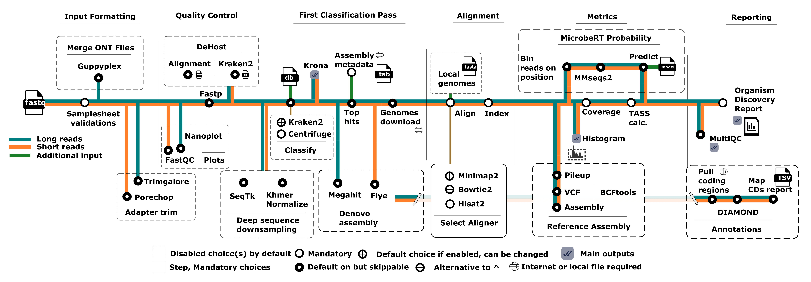
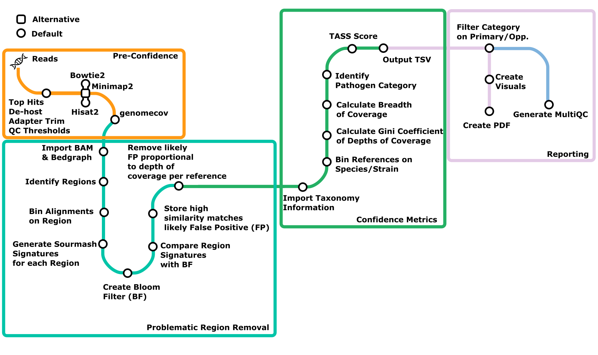
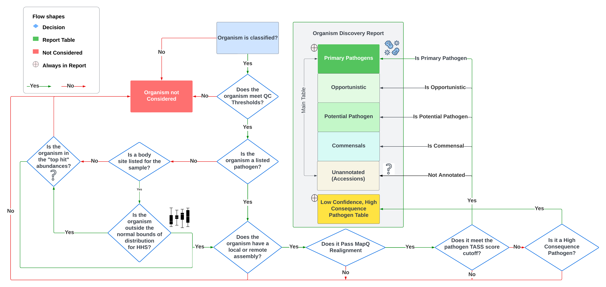
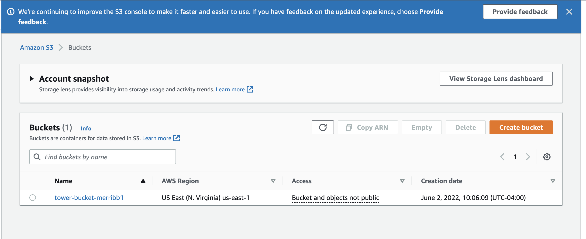
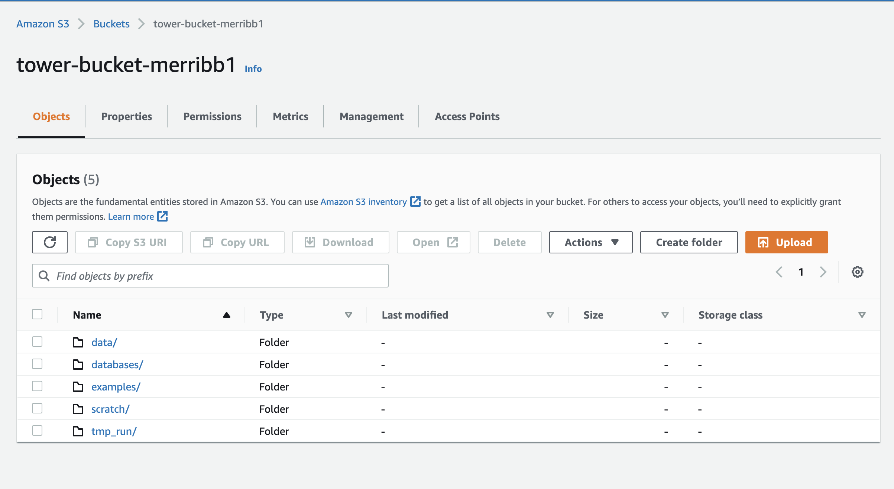
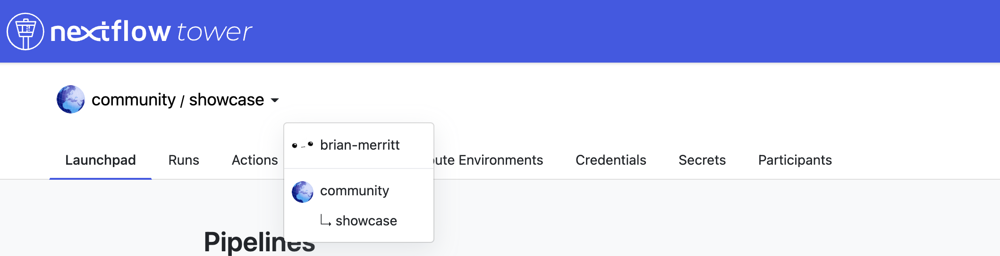
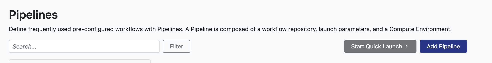
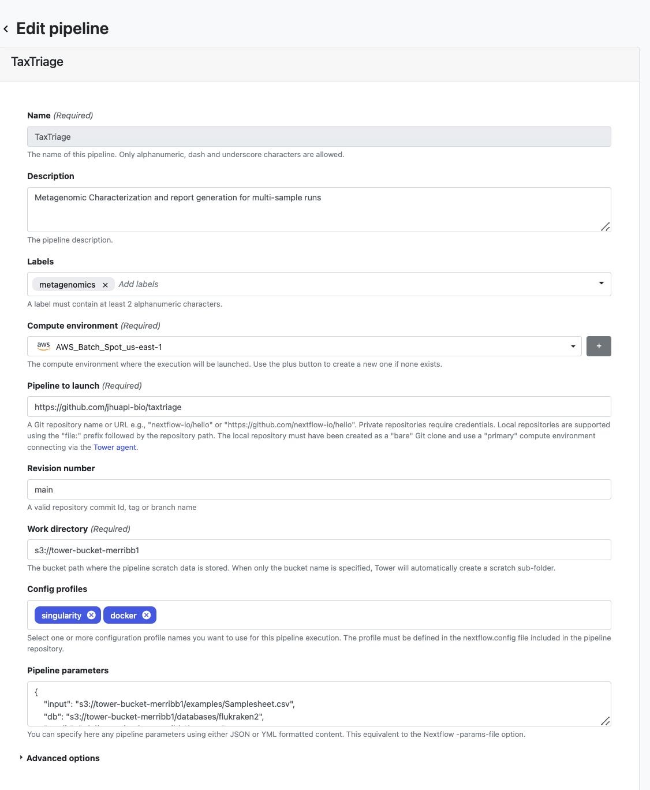
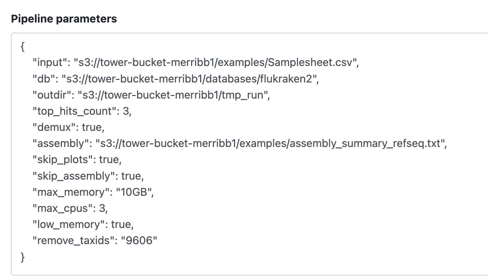

# taxtriage: Usage

> _Documentation of pipeline parameters is generated automatically from the pipeline schema and can no longer be found in markdown files._

See [Troubleshooting](./troubleshooting.md) for a working set of information on the common issues found or FAQ needs

## Introduction

<!-- TODO nf-core: Add documentation about anything specific to running your pipeline. For general topics, please point to (and add to) the main nf-core website. -->

## Samplesheet input

You will need to create a samplesheet with information about the samples you would like to analyse before running the pipeline. Use this parameter to specify its location. It has to be a comma-separated file with 3 columns, and a header row as shown in the examples below.

```console
--input '[path to samplesheet file]'
```

:warning: Be aware that you **MUST** have different sample name values for each line. These must be unique!

### Multiple Samples

The `sample` identifiers have to be the same when you have re-sequenced the same sample more than once e.g. to increase sequencing depth. The pipeline will concatenate the raw reads before performing any downstream analysis. Below is an example for the same sample sequenced across 3 lanes:

```console
sample,platform,fastq_1,fastq_2,sequencing_summary,trim,type
NB03,OXFORD,examples/data/fastq_demux/NB03,,,FALSE,nasal
BC05_flu,OXFORD,examples/data/BC05.fastq.gz,,,FALSE,nasal
longreads,OXFORD,examples/data/nanosim_metagenome.fastq.gz,,,FALSE,gut
shortreads,ILLUMINA,examples/data/iss_reads_R1.fastq.gz,examples/data/iss_reads_R2.fastq.gz,,TRUE,blood
```

Supported "type" available from HMP

1. stool
2. oral
3. throat
4. skin
5. vaginal

Any other body site not listed will not take HMP into consideration. Only abundances hitting the "threshold" for top hits `--top_hits` or `--top_per_taxa` will be considered. See [here](https://github.com/jhuapl-bio/taxtriage/blob/main/assets/TASSDiagram.png) for decision tree information on how top hits are calculated at a high level. See [here](https://github.com/jhuapl-bio/taxtriage/blob/main/docs/usage.md#cli-parameters-possible-and-explained) for parameter descriptions.

### Multiple Samples AND Platforms

The `sample` identifiers have to be the same when you have re-sequenced the same sample more than once e.g. to increase sequencing depth. The pipeline will concatenate the raw reads before performing any downstream analysis. Below is an example for the same sample sequenced across 3 lanes:

```console
sample,platform,fastq_1,fastq_2,sequencing_summary,trim,type
NB03,OXFORD,examples/data/fastq_demux/NB03,,,FALSE,nasal
BC05_flu,OXFORD,examples/data/BC05.fastq.gz,,,FALSE,nasal
longreads,OXFORD,examples/data/nanosim_metagenome.fastq.gz,,,FALSE,gut
shortreads,ILLUMINA,examples/data/iss_reads_R1.fastq.gz,examples/data/iss_reads_R2.fastq.gz,,TRUE,blood
```

### Samplesheet Information

| Column               | Description                                                                                                                                                                                                                                                                                                                                                                                                                                                                                                                                                                                                 |
| -------------------- | ----------------------------------------------------------------------------------------------------------------------------------------------------------------------------------------------------------------------------------------------------------------------------------------------------------------------------------------------------------------------------------------------------------------------------------------------------------------------------------------------------------------------------------------------------------------------------------------------------------- |
| `sample`             | **MANDATORY** Custom sample name. This entry will be identical for multiple sequencing libraries/runs from the same sample. Spaces in sample names are automatically converted to underscores (`_`).                                                                                                                                                                                                                                                                                                                                                                                                        |
| `platform`           | **MANDATORY** Platform used, [ILLUMINA, OXFORD, PACBIO]. If omitted or left blank, assumes ILLUMINA. If using PacBio, specify PACBIO. If using ONT tools, specify OXFORD. Else, specify ILLUMINA. Other sequencing platforms are NOT directly supported but can be replaced/swapped for their respective platform based on the "type" of sequencing read set. For instance, if using paired-end reads of non Illumina sequencers, specify ILLUMINA. There is no guaruntee that, if the platform is not one of these three, that all steps will be supported or work properly so use at your own discretion. |
| `fastq_1`            | **MANDATORY** Full path to FastQ file for Illumina short reads 1 OR OXFORD reads. File MUST be gzipped and have the extension ".fastq.gz" or ".fq.gz".                                                                                                                                                                                                                                                                                                                                                                                                                                                      |
| `fastq_2`            | OPTIONAL Full path to FastQ file for Illumina short reads 2. File MUST be gzipped and have the extension ".fastq.gz" or ".fq.gz".                                                                                                                                                                                                                                                                                                                                                                                                                                                                           |
| `trim`               | OPTIONAL TRUE/FALSE, do you want to run trimming on the sample?                                                                                                                                                                                                                                                                                                                                                                                                                                                                                                                                             |
| `sequencing_summary` | OPTIONAL If detected, output plots based on the the sequencing summary file for that sample                                                                                                                                                                                                                                                                                                                                                                                                                                                                                                                 |
| `type`               | OPTIONAL But Recommended. Type of sample such as blood, stool etc.                                                                                                                                                                                                                                                                                                                                                                                                                                                                                                                                          |
| `needscompressing`   | OPTIONAL but required if providing a non-compressed fastq file                                                                                                                                                                                                                                                                                                                                                                                                                                                                                                                                              |

An [example samplesheet](../examples/Samplesheet.csv) has been provided with the pipeline alongside some demo data.

## Running the pipeline

The typical command for running the pipeline is as follows:

```console
nextflow run https://github.com/jhuapl-bio/taxtriage --input samplesheet.csv --outdir OUTDIR -profile docker
```

:warning: please be aware that for local instances, due to limited resources, we have defined several config profiles. Please try `-profile test,docker` for a trial run of dummy data and then use `-profile local,docker` first on your own data before manually adjusting parameters

This will launch the pipeline with the `docker` configuration profile. See below for more information about profiles.

Note that the pipeline will create the following files in your working directory:

```console
work                # Directory containing the nextflow working files
<OUTIDR>            # Finished results in specified location (defined with --outdir)
.nextflow_log       # Log file from Nextflow
# Other nextflow hidden files, eg. history of pipeline runs and old logs.
```

##### Define single samples

If you would not like to use a csv file as input (samplesheet) you can currently specify a single sample by providing the fastq paths (paired-end supported) using the parameters

1. `fastq_1` & `fastq_2` (optional - for paired end sets)
2. `sample` (optional) - this is the sample name you want to give. If left undefined it will default to the basename of `fastq_1`
3. `type` (optional) - sample type as defined earlier e.g. blood, stool etc. Leafing it blank will set it to "unknown"

To run, you simply specify command such as:

```
nextflow run main.nf -profile test,docker -resume --fastq_1 examples/data/iss_reads_R1.fastq.gz --fastq_2 examples/data/iss_reads_R2.fastq.gz --type blood --sample test
```

This will create a temporary samplesheet and kickstart all of the usual steps as if you provided a csv file with a single sample in it.

**We are currently improving the pipeline to have more than one sample specified (by giving a directory) but this update is not merged yet.**

There are additional parameters that all equate to the columns of a samplesheet as previously described that are further explained in the CLI table below.

#### Using the defined FASTA pathogen sheet rather than just Kraken2

```
nextflow run main.nf -profile mce,docker -resume --fastq_1 examples/data/iss_reads_R1.fastq.gz --fastq_2 examples/data/iss_reads_R2.fastq.gz --type blood --sample test
```

⚠️This process will download the pathogen fasta file on the first run. You can also download the fasta file directly like:

```
wget https://github.com/jhuapl-bio/datasets/raw/main/references/pathogens.fasta.gz && gzip -d pathogens.fasta.gz
```

Then run:

```
nextflow run main.nf -profile mce_seqera,docker -resume --fastq_1 examples/data/iss_reads_R1.fastq.gz --fastq_2 examples/data/iss_reads_R2.fastq.gz --type blood --sample test --reference_fasta_file pathogens.fasta
```

❗ The purpose of this is to ALWAYS align against known pathogens in the pathogen annotation sheet.

### CLI Parameters Possible and Explained

| Parameter                                             | Description                                                                                                                                                                                                                                                                                                                                                                                                                                                                                                                                                                                                                                                                                                                                                                                                                                           |
| ----------------------------------------------------- | ----------------------------------------------------------------------------------------------------------------------------------------------------------------------------------------------------------------------------------------------------------------------------------------------------------------------------------------------------------------------------------------------------------------------------------------------------------------------------------------------------------------------------------------------------------------------------------------------------------------------------------------------------------------------------------------------------------------------------------------------------------------------------------------------------------------------------------------------------- |
| `--input <samplesheet.csv_path>`                      | CSV file containing samplesheet information for each sample. See [Samplesheet section](#samplesheet-information)                                                                                                                                                                                                                                                                                                                                                                                                                                                                                                                                                                                                                                                                                                                                      |
| `--outdir <path_to_output_to_be_made>`                | Output folder.                                                                                                                                                                                                                                                                                                                                                                                                                                                                                                                                                                                                                                                                                                                                                                                                                                        |
| `--fastq_1 <path/to/fastq_1>`                         | Path to the first read file (FASTQ format) for single-end or paired-end sequencing. If `--input` is not provided, this is required to dynamically generate a samplesheet.                                                                                                                                                                                                                                                                                                                                                                                                                                                                                                                                                                                                                                                                             |
| `--fastq_2 <path/to/fastq_2>` (optional)              | Path to the second read file for paired-end sequencing. Optional — if not supplied, data is treated as single-end.                                                                                                                                                                                                                                                                                                                                                                                                                                                                                                                                                                                                                                                                                                                                    |
| `--platform [ILLUMINA,OXFORD,PACBIO]`                 | Sequencing platform used for the data. Defaults to `ILLUMINA` if not specified. This helps determine appropriate preprocessing steps.                                                                                                                                                                                                                                                                                                                                                                                                                                                                                                                                                                                                                                                                                                                 |
| `--trim`                                              | Flag for Whether the reads should be trimmed prior to downstream processing. Accepts `"true"` or `"false"`. Defaults to `false`.                                                                                                                                                                                                                                                                                                                                                                                                                                                                                                                                                                                                                                                                                                                      |
| `--type <str>`                                        | Sample type or classification (e.g., `blood`, `stool`) Optional — can be used for filtering or labeling during analysis.                                                                                                                                                                                                                                                                                                                                                                                                                                                                                                                                                                                                                                                                                                                              |
| `--sample <sample_name>`                              | Sample identifier used in the dynamically generated samplesheet. Defaults to `"sample"` if not specified. Useful for single-sample runs without an input CSV.                                                                                                                                                                                                                                                                                                                                                                                                                                                                                                                                                                                                                                                                                         |
| `--sequencing_summary <path/to/summary.txt>`          | Optional path to a sequencing summary file (e.g., from Nanopore runs). This is only used for specific preprocessing or reporting steps if applicable.                                                                                                                                                                                                                                                                                                                                                                                                                                                                                                                                                                                                                                                                                                 |
| `--use_denovo`                                        | Performing the de-novo assembly process. Currently this is recommmended as MEGAHIT for short reads and FLYE for long reads. Disabled by default                                                                                                                                                                                                                                                                                                                                                                                                                                                                                                                                                                                                                                                                                                       |
| `--reference_assembly`                                | Perform the reference-based assembly on reads against top hit assemblies or assemblies provided as a local file. Performes variant analysis by default. Disabled by default                                                                                                                                                                                                                                                                                                                                                                                                                                                                                                                                                                                                                                                                           |
| `--skip_fastp`                                        | TRUE/FALSE, do not filter with fastp                                                                                                                                                                                                                                                                                                                                                                                                                                                                                                                                                                                                                                                                                                                                                                                                                  |
| `--skip_plots`                                        | TRUE/FALSE, do not make any plots                                                                                                                                                                                                                                                                                                                                                                                                                                                                                                                                                                                                                                                                                                                                                                                                                     |
| `--remove_taxids  <numbers[]>`                        | "taxidA taxidB..." a list of one or more taxids to remove from the kraken report prior to downstream analysis. Use "9606" for human reads                                                                                                                                                                                                                                                                                                                                                                                                                                                                                                                                                                                                                                                                                                             |
| `--compress_species`                                  | TRUE/FALSE, (default: FALSE) Compress all taxonomies in the ODR to the species level. By default, all organisms mapped to the pathogen sheet and NCBI's assembly file will be present per row if present in the sample.                                                                                                                                                                                                                                                                                                                                                                                                                                                                                                                                                                                                                               |
| `--show_commensals`                                   | TRUE/FALSE, Do/Don't (default: Don't) show commensals in the final report                                                                                                                                                                                                                                                                                                                                                                                                                                                                                                                                                                                                                                                                                                                                                                             |
| `--show_potentials`                                   | TRUE/FALSE, Do/Don't (default: Don't) show potential pathogens in the final report                                                                                                                                                                                                                                                                                                                                                                                                                                                                                                                                                                                                                                                                                                                                                                    |
| `--show_unidentified`                                 | TRUE/FALSE, Do/Don't (default: Don't) show unknown or unannotated pathogens in the final report                                                                                                                                                                                                                                                                                                                                                                                                                                                                                                                                                                                                                                                                                                                                                       |
| `--k2_confidence  <numbers[]>`                        | Minimum confidence to classify a read using KRAKEN2 only. See [here](https://github.com/DerrickWood/kraken2/blob/master/docs/MANUAL.markdown#confidence-scoring) for more information.                                                                                                                                                                                                                                                                                                                                                                                                                                                                                                                                                                                                                                                                |
| `--organisms  <numbers[] or strings[]>`               | Organisms list (names or taxids) you want to pull from to get a reference. Used if you are skipping kraken2 only. Separate by a list of spaces like "1254 573"                                                                                                                                                                                                                                                                                                                                                                                                                                                                                                                                                                                                                                                                                        |
| `--fuzzy`                                             | TRUE/FALSE, Match names of organisms by their names (enabled) rather than taxids                                                                                                                                                                                                                                                                                                                                                                                                                                                                                                                                                                                                                                                                                                                                                                      |
| `--get_pathogens`                                     | TRUE/FALSE, Use the pathogens sheet FASTA file instead of k2's top hits. Default is FALSE                                                                                                                                                                                                                                                                                                                                                                                                                                                                                                                                                                                                                                                                                                                                                             |
| `--skip_realignment`                                  | TRUE/FALSE, Skip realignment step. You will not get a metrics report as a result                                                                                                                                                                                                                                                                                                                                                                                                                                                                                                                                                                                                                                                                                                                                                                      |
| `--skip_kraken2`                                      | TRUE/FALSE, Skip kraken2. If you do not provide a --reference_fasta value and you enable this skip then your pipeline will fail.                                                                                                                                                                                                                                                                                                                                                                                                                                                                                                                                                                                                                                                                                                                      |
| `--pathogens`                                         | OPTIONAL. Enable pathogen discovery mode. See assets/pathogen_sheet.txt for the default sheet. You can ue your own designation so long as it is in the same format as the provided example. This is an ongoing list of annotated known human-pathogens that are mapped to your alignments. Requires alignment to be performed. The "test" config profile automatically uses this.                                                                                                                                                                                                                                                                                                                                                                                                                                                                     |
| `--distributions`                                     | This is set, by default to use this [file](https://github.com/jhuapl-bio/taxtriage/blob/main/assets/taxid_abundance_stats.hmp.tsv.gz). However, if you have your own set of distributions for any number of species and their abundances, please specify it here. For example, run `--distributions assets/taxid_abundance_stats.hmp.tsv.gz` for the default. The file can be either in the `.tsv.gz` format or a decompressed `.tsv`                                                                                                                                                                                                                                                                                                                                                                                                                 |
| `--add_irregular_top_hits`                            | Adds irregular distributions (outside percentile zscore) to top hits. Default is fale and only pathogens and top abu hits are considered                                                                                                                                                                                                                                                                                                                                                                                                                                                                                                                                                                                                                                                                                                              |
| `--skip_multiqc`                                      | TRUE/FALSE, Skip multiqc final report                                                                                                                                                                                                                                                                                                                                                                                                                                                                                                                                                                                                                                                                                                                                                                                                                 |
| `--minq <number>`                                     | What minimum quality would you want in your samples. Disabled if you run --skip_fastp. Default is 7 for Oxford Nanopore, 20 for Illumina                                                                                                                                                                                                                                                                                                                                                                                                                                                                                                                                                                                                                                                                                                              |
| `--minmapq <number>`                                  | What minimum mapping quality would you want in your sample alignments. Default is 5                                                                                                                                                                                                                                                                                                                                                                                                                                                                                                                                                                                                                                                                                                                                                                   |
| `--mmap2_window <number>`                             | What window size to use for alignment with minimap2. Default is 10 for minimap2 if disabled.                                                                                                                                                                                                                                                                                                                                                                                                                                                                                                                                                                                                                                                                                                                                                          |
| `--mmap2_fraction_filter <number>`                    | filter out top FLOAT fraction of repetitive minimizers. Default is 0.0009 if disabled.                                                                                                                                                                                                                                                                                                                                                                                                                                                                                                                                                                                                                                                                                                                                                                |
| `--organisms_file <file>`                             | A single file that contains what organisms (name or taxid) you want to pull. You can enable this if you are skipping kraken2 as well                                                                                                                                                                                                                                                                                                                                                                                                                                                                                                                                                                                                                                                                                                                  |
| `--subsample <number>`                                | Take a subsample of n reads from each sample. Useful if your data size is very large and you want a quick triage analysis                                                                                                                                                                                                                                                                                                                                                                                                                                                                                                                                                                                                                                                                                                                             |
| `--downsample`                                        | Uses the BBNorm submodule within the bbmap suite (JGI) to reduce redundant reads to downstream analysis. Useful for deep sequencing samples (e.g. 40 GB of reads per sample)                                                                                                                                                                                                                                                                                                                                                                                                                                                                                                                                                                                                                                                                          |
| `--reference_fasta <filepath>`                        | Location of a single reference fasta, multiple files (separate by space and within quotations ""), or a directory of fasta files to run alignment on RATHER than (or in addition to) downloading references from NCBI from post K2 or manual organism taxids/names. Useful if you know what you're looking for or have no internet connection to pull said references. Header format must be in the "all" format from NCBI's ftp [assembly site](https://ftp.ncbi.nlm.nih.gov/genomes/all/) and should be ">accession description" where there is a **space** following the accession with the organism chr/contig description of the sequence. Technically, the accession does not matter as the pipeline only needs to match the organism space that follows the first space in the header. Example: **>NC_003663.2 Cowpox virus, complete genome** |
| `--recursive_reference`                               | TRUE/FALSE (default). Search recursively through a directory provided in the `--reference_fasta` parameter                                                                                                                                                                                                                                                                                                                                                                                                                                                                                                                                                                                                                                                                                                                                            |
| `--db <path_to_kraken2_database>`                     | Database to be used. IF `--low_memory` is called it will read the database from the fileystem. If not called, it will load it all into memory first so ensure that the memory available (limited as well by `--max_memory` is enough to hold the database). If using with --download-db, choose from download options {minikraken2, flukraken2} instead of using a path. [See here for a full list](#supported-default-databases)                                                                                                                                                                                                                                                                                                                                                                                                                     |
| `--download_db`                                       | Download the preset database indicated in `--db` to `--outdir`                                                                                                                                                                                                                                                                                                                                                                                                                                                                                                                                                                                                                                                                                                                                                                                        |
| `--download_taxdump`                                  | Download the nodes and names.dmp from ncbi taxonomy. Adds the genus to the report pdf taxonomic id column                                                                                                                                                                                                                                                                                                                                                                                                                                                                                                                                                                                                                                                                                                                                             |
| `--taxdump`                                           | DIRECTORY. Use a local nodes and names.dmp from ncbi taxonomy. Adds the genus to the report pdf taxonomic id column                                                                                                                                                                                                                                                                                                                                                                                                                                                                                                                                                                                                                                                                                                                                   |
| `--sensitive`                                         | Sensitive mode for confidence metrics. Uses all BAM query alignments rather than the reference from the alignment. Considered I/O intensive and much slower. Useful if there are a lot of variants present in the alignments, otherwise keep disabled                                                                                                                                                                                                                                                                                                                                                                                                                                                                                                                                                                                                 |
| `--metaphlan`                                         | Use Metaphlan. Must specify a database path that contains .pkl and .btl2 (bowtie2 index) files                                                                                                                                                                                                                                                                                                                                                                                                                                                                                                                                                                                                                                                                                                                                                        |
| `--max_memory <number>GB`                             | Max RAM you want to dedicate to the pipeline. Most of it will be used during Kraken2 steps so ensure you have more memory than the size of the `--db` called                                                                                                                                                                                                                                                                                                                                                                                                                                                                                                                                                                                                                                                                                          |
| `-latest`                                             | Use the latest revision (-r). If you want to autopull the latest commit for a branch from https://github.com/jhuapl-bio/taxtriage, specify this. Used in Basestack and the Cloud (default toggle)                                                                                                                                                                                                                                                                                                                                                                                                                                                                                                                                                                                                                                                     |
| `--low_memory <number>`                               | If you don't have enough memory to load the kraken2 db, call this to read it from the filesystem for each read. THIS IS MUCH SLOWER THAN THE DEFAULT METHOD                                                                                                                                                                                                                                                                                                                                                                                                                                                                                                                                                                                                                                                                                           |
| `--max_cpus <number>`                                 | Max CPUs you want to dedicate to the pipeline                                                                                                                                                                                                                                                                                                                                                                                                                                                                                                                                                                                                                                                                                                                                                                                                         |
| `--gini_weight <number>`                              | Gini Weight to the TASS Score. This is the measure of how spread out the depths/coverages are in an alignment to an organism. The more spread out or evenly distributed the regions, the higher the score.                                                                                                                                                                                                                                                                                                                                                                                                                                                                                                                                                                                                                                            |
| `--breadth_weight <number>`                           | Minimum Log-based breadth weight for TASS Score calculation                                                                                                                                                                                                                                                                                                                                                                                                                                                                                                                                                                                                                                                                                                                                                                                           |
| `--minhash_weight <number>`                           | Weight for minhash filtering. It is the combination of % of reads removed + % of breadth new / 2                                                                                                                                                                                                                                                                                                                                                                                                                                                                                                                                                                                                                                                                                                                                                      |
| `--mapq_weight <number>`                              | MapQ Weight to the TASS Score. If filtering on 20+, this will likely all be 1 or close to 1. Disabled by default                                                                                                                                                                                                                                                                                                                                                                                                                                                                                                                                                                                                                                                                                                                                      |
| `--hmp_weight <number>`                               | TASS Score weight for HMP percentile, recommend disabling if sample is unknown                                                                                                                                                                                                                                                                                                                                                                                                                                                                                                                                                                                                                                                                                                                                                                        |
| `--disparity_score_weight <number>`                   | The weight for giving more of a bonus for more prevalent organisms. Unused by default                                                                                                                                                                                                                                                                                                                                                                                                                                                                                                                                                                                                                                                                                                                                                                 |
| `--dispersion_factor <number>`                        | TASS Score Dispersion factor. This is the measure of how spread out the depths/coverages are in an alignment to an organism. The more spread out or evenly distributed the regions, the higher the score.                                                                                                                                                                                                                                                                                                                                                                                                                                                                                                                                                                                                                                             |
| `--reward_factor <number>`                            | TASS Score Reward factor. This is the measure of how spread out the depths/coverages are in an alignment to an organism. The more spread out or evenly distributed the regions, the higher the score.                                                                                                                                                                                                                                                                                                                                                                                                                                                                                                                                                                                                                                                 |
| `--top_per_taxa "<taxid:amount:rank>"]`               | One or more 3 element values for the minimum taxa at a rank. Example "10239:20:S 2:20:S" is minimum 20 virus species (10239 is Virus) AND (separated by space for a new definition) 20 Bacteria (2) species. Possible Rank codes to use are the single alphabet letter: G(enus),S(pecies),P(hylum),F(amily),O(rder),C(lass)                                                                                                                                                                                                                                                                                                                                                                                                                                                                                                                           |
| `--genome`                                            | Pull one of the pre-made igenomes databases for host removal. Available list at [here](https://github.com/nf-core/rnaseq/blob/e049f51f0214b2aef7624b9dd496a404a7c34d14/conf/igenomes.config#L22) or [here](https://ewels.github.io/AWS-iGenomes/) (aws cli or curl command) to download them locally                                                                                                                                                                                                                                                                                                                                                                                                                                                                                                                                                  |
| `--remove_reference_file`                             | Remove all reads that align to a set of accessions in a single fasta file                                                                                                                                                                                                                                                                                                                                                                                                                                                                                                                                                                                                                                                                                                                                                                             |
| `--demux`                                             | If your Samplesheet contains a folder (rather than 1-2 fastq files), you MUST call this flag                                                                                                                                                                                                                                                                                                                                                                                                                                                                                                                                                                                                                                                                                                                                                          |
| `--use_megahit_longreads`                             | If running denovo assembly, use MEGAHIT for longreads. Default is disabled = FLYE                                                                                                                                                                                                                                                                                                                                                                                                                                                                                                                                                                                                                                                                                                                                                                     |
| `--decompress_pre_megahit`                            | Some HPC envs cant use megahit with gz files, enable if this is the case or you experience INPUT/OUTPUT errors at this step.                                                                                                                                                                                                                                                                                                                                                                                                                                                                                                                                                                                                                                                                                                                          |
| `--top_hits_count`                                    | Minimum taxa to filter out per rank level. If top_per_taxa specified, whatever is the larger of the 2 values for the results takes priority.                                                                                                                                                                                                                                                                                                                                                                                                                                                                                                                                                                                                                                                                                                          |
| `--get_features`                                      | Pull Features (CDS) for each assembly present. Performs Coverage on each feature                                                                                                                                                                                                                                                                                                                                                                                                                                                                                                                                                                                                                                                                                                                                                                      |
| `--min_conf <number>`                                 | Minimum confidence to appear within the pdf report (ODR)                                                                                                                                                                                                                                                                                                                                                                                                                                                                                                                                                                                                                                                                                                                                                                                              |
| `--use_bt2`                                           | Use Bowtie2 instead of minimap2 for Illumina reads                                                                                                                                                                                                                                                                                                                                                                                                                                                                                                                                                                                                                                                                                                                                                                                                    |
| `--get_variants`                                      | Perform mpileup on your assemblies against your reads. Disabled by default. Auto-called if you are doing a reference-based assembly                                                                                                                                                                                                                                                                                                                                                                                                                                                                                                                                                                                                                                                                                                                   |
| `-resume`                                             | Resume the run from where it left off. IF not called the pipeline will restart from the Samplesheet check each time                                                                                                                                                                                                                                                                                                                                                                                                                                                                                                                                                                                                                                                                                                                                   |
| `-r [main, stable, etc.]`                             | Specify the branch/revision name to use if pulling from github (not local main.nf file)                                                                                                                                                                                                                                                                                                                                                                                                                                                                                                                                                                                                                                                                                                                                                               |
| `-profile [local,test,test_viral,docker,singularity]` | Default profile, 2 tests, Docker, or Singularity for execution reasons                                                                                                                                                                                                                                                                                                                                                                                                                                                                                                                                                                                                                                                                                                                                                                                |

⚠️ Please note that for the `--reference_fasta` parameter, you MUST use the designated header format from the FTP site that NCBI hosts for assemblies at [here](https://ftp.ncbi.nlm.nih.gov/genomes/all/). This format should looke like:

```
>NC_003663.2 Cowpox virus, complete genome
```

In this case, the accession (can be any value, default is NCBI's nt or refseq acc) is followed by a **space** and then the organism name. The pipeline must "fuzzy" match the organism name from this header from the assembly summary file (see NCBI's assembly file [here](https://ftp.ncbi.nlm.nih.gov/genomes/refseq/assembly_summary_refseq.txt)) to understand how the parsing happens in regards to an organism.

### Important output locations

- `report`: Organism Discovery Report PDF, MultiQC, Krona Plot (from Kraken2), Microbial Detection Txt File
  - `Combined ODR` - `all.organisms.report.pdf`
  - `Sample ODR` - `<samplename>.organisms.report.pdf`
  - `MultiQC` - `multiqc_report.html`
  - `Microbial Sheet` - `<samplename|all>.report.txt`
  - `Krona` - `combined_krona_kreports.html`
- `alignments`: Post minimap2 alignment to top hits or local reference fasta file(s). Also contains histograms of coverages
  - `Histogram` (v1.3.0 or later) - `<samplename>.histo.txt`
  - `BAM` - `<samplename>.bam`
- `samtools`: Raw Alignment Coverage and Depth Files
  - `Coverage` - `<samplename>.txt`
  - `Depth` - `<samplename>.tsv`
    - Each contig/chromosome is present in this file, 3rd column is depth at position (col 2).
- `bcftools`: Variant And Consensus – Optional Module (--reference_assembly called)
  - Variants - `<samplename>.<taxid>.vcf.gz`
  - Consensus - `<samplename>.consensus.fa`
- `nanoplot`/`fastqc` – QC plots and stats
- `mergedkrakenreport` – `krakenreport.merged_mqc.tsv` - Top Hits for each sample – kraken2 only

### General Procedure

There are a lot of moving parts in the pipeline (see Figure 1) for a detailed railway map of modules



Ultimately, the pipeline has several mandatory and optional steps that can be defined as:

1. Trimming and QC
   - Includes plots of QC filtering metrics
2. Host Removal (alignment-based)
   - Duplicates unclassified (non-host) reads.
   - [Minimap2](https://github.com/lh3/minimap2) is used for both data types (short or long reads) based on 2 studies [1](https://www.ncbi.nlm.nih.gov/pmc/articles/PMC9040843/) and [2](https://www.nature.com/articles/s41467-021-26865-w) conducted showing a slightly lower false negative rate relative to [Bowtie2](https://bowtie-bio.sourceforge.net/bowtie2/index.shtml)
3. Kraken2 Metagenomics Classification
   - Includes Krona Plots - a **very** important file for initial understanding abundance from a metagenomics perspective.
   - This is skippable if you assign `--reference_fasta` FASTA file or the `--organisms/--organisms_file` parameters. (set: `--skip_kraken2`)
   - Always consider limitations in your database of use. See [databases](https://benlangmead.github.io/aws-indexes/k2) publicly available.
4. Top Hits Assignments
   - See Figure 2 for flow diagram on decision tree
5. Reference Prep
   - Assemblies based on top hits are pulled from NCBI - Required Internet connection and the relative assembly to be findable
     - If skipping Kraken2 and using a local FASTA file, this part is skipped.
   - Index built for each reference FASTA file (Bowtie2 only - Illumina reads)
6. Alignment
   - Pulled/local assemblies are aligned to ALL classified reads (if using Kraken2) or raw reads (if using local FASTA reference) post-QC steps. Currently, only the "best hits" are assigned per read. Soon to introduce a parameter to raise that limit.
   - Currently, we separate short and long reads to be run between Bowtie2 & Minimap2, respectively. While various studies have been performed and declared minimap2 to be highly performative for short reads, a few indicate that from a taxonomic/metagenomics perspective [Minimap2 still underperforms relative to Bowtie2](https://www.ncbi.nlm.nih.gov/pmc/articles/PMC9040843/). We will actively track performances as these platforms continue to be updated to ensure the optimal aligner is used for each data type.
7. Stats
   - Generate Coverage histogram (`samtools/samplename.histo.txt`)
   - Generate Depth (`samtools/samplename.tsv`)
8. Reference Assembly (optional - set `--reference_assembly` to enable)
   - This is a long process
   - Generates VCF (variant) files in `bcftools/samplename.vcf.txt`)
   - Generates Assembly file(s) in `bcftools/samplename.consensus.fa`
9. Organism Discovery Report Analysis
   - MultiQC - Raw alignment information and stats found in `multiqc/multiqc_report.html`
   - Simplified Report (Main Report) - Found in `report/pathogens.report.pdf`
     - Contains all downstream-passed alignments and their classification in the first table (see example report in Figure 3)
     - Primary report to understand and perform reflex reponse on.

<span>Figure 3</span>
</img>

#### Final Text Output location

As previously stated in the list of all _important_ outputs, we output both our reports in MultiQC (html) and PDF formats within the `report` directory. Additionally, for each sample as well as the merged report, there is a supplemental `.txt` file containing all of the information used to create the confidence tables in the former files.

The column setup for the final merged file (`report/all.organisms.report.txt`) is:

| **Column Name**              | **Description**                                                                                                                                                                                                                                    |
| ---------------------------- | -------------------------------------------------------------------------------------------------------------------------------------------------------------------------------------------------------------------------------------------------- |
| **Index**                    | A sequential id for each row                                                                                                                                                                                                                       |
| **index**                    | A secondary id.                                                                                                                                                                                                                                    |
| **Detected Organism**        | The name of the organism identified.                                                                                                                                                                                                               |
| **Specimen ID**              | The ID, usually Taxid, of the organism                                                                                                                                                                                                             |
| **Sample Type**              | The Type of sample, can be unknown, blood, stool, etc.                                                                                                                                                                                             |
| **% Reads**                  | The percentage of the total sequencing reads that are assigned to the detected organism.                                                                                                                                                           |
| **# Reads Aligned**          | The total number of sequencing reads that successfully aligned (mapped) to the organism’s reference genome or target sequence and above the minimum MapQ score                                                                                     |
| **% Aligned Reads**          | The percentage of reads from the dataset that were successfully aligned to the reference sequence.                                                                                                                                                 |
| **Coverage**                 | A measure of how much of the organism’s genome is aligned                                                                                                                                                                                          |
| **HHS Percentile**           | A rank value for the abundance observed vs expected in a given (HMP)[https://www.hmpdacc.org/resources/data_browser.php] dataset.                                                                                                                  |
| **IsAnnotated**              | If the organism is listed anywhere in the pathogen (sheet)[https://github.com/jhuapl-bio/taxtriage/blob/main/assets/pathogen_sheet.csv]                                                                                                            |
| **AnnClass**                 | If the organisms is directly linked (based on name or taxid) to the (sheet)[https://github.com/jhuapl-bio/taxtriage/blob/main/assets/pathogen_sheet.csv] or derived based on the parent (usually species to subspecies check)                      |
| **Microbial Category**       | What type of pathogen it is. Choices are (Unknown, Commensal, Primary, Opportunistic, Potential).                                                                                                                                                  |
| **High Consequence**         | A flag to indicate if the pathogen is listed as an important pathogen. These organisms will appear in the report regardless of TASS score cutoffs.                                                                                                 |
| **Taxonomic ID #**           | A numeric identifier from the NCBI taxonomy database.                                                                                                                                                                                              |
| **Status**                   | N/A                                                                                                                                                                                                                                                |
| **Gini Coefficient**         | Also known as the ADFS in documentation, this is the deviation of an even distribution of depth and breadth of coverage for any number of chromosomes belonging to an organism's assembly. _This contributes by default to the overall TASS score_ |
| **Mean BaseQ**               | The average base quality score across all sequencing reads, indicating the overall confidence in the individual nucleotide calls.                                                                                                                  |
| **Mean MapQ**                | The average mapping quality score, representing the average confidence in how well the reads align to the reference genome.                                                                                                                        |
| **Mean Coverage**            | The coverage mean of all contigs/chromosomes in the organisms' assembly                                                                                                                                                                            |
| **Mean Depth**               | What is the mean depth of all positions in the assembly for the alignment set for any given organism.                                                                                                                                              |
| **isSpecies**                | Whether the detected organism has been identified at the species level, as opposed to a higher/lower taxonomic rank.                                                                                                                               |
| **Pathogenic Subsp/Strains** | TRUE/FALSE if the annotation is listed as a pathogen in the pathogen discovery (sheet)[https://github.com/jhuapl-bio/taxtriage/blob/main/assets/pathogen_sheet.csv]                                                                                |
| **K2 Reads**                 | The number of Kraken2-assigned reads                                                                                                                                                                                                               |
| **Parent K2 Reads**          | How many k2 reads were hit to the parent taxid of the given annotation.                                                                                                                                                                            |
| **MapQ Score**               | Average MapQ score for all chromosomes/contigs/scaffolds                                                                                                                                                                                           |
| **Disparity Score**          | How many reads aligned for this organism vs all other aligned organisms in the sample.                                                                                                                                                             |
| **Minhash Score**            | Disparity of likely false positive removal based on the change in both breadth of coverage decrease & the total number of reads. _This contributes by default to the overall TASS score_                                                           |
| **Diamond Identity**         | The avg. percent identity of the CDSs to the assigned regions that were run through DIAMOND.                                                                                                                                                       |
| **K2 Disparity Score**       | Difference in assigned reads from the aligner vs the classifier (default is kraken2)                                                                                                                                                               |
| **Siblings score**           | A measure that compares the read alignment or similarity against related organisms (or “siblings”) within the same taxonomic group. In short, this is comparing the abundance of a given species against all other species in the genera.          |
| **Breadth Weight Score**     | A score representing the extent (breadth) of genomic coverage, often weighted to emphasize regions of higher importance or significance. _This contributes by default to the overall TASS score_                                                   |
| **TASS Score**               | The score assigned to the given annotation based on the defined weights from the Breadth of Coverage, Sourmash Comparison, and AFDS scores                                                                                                         |
| **Group**                    | The parent of each of the taxids/organisms. By default and currently only supported as genus or the species of a given subspecies/strain                                                                                                           |

The distribution metrics are defined based on a all publicly available healthy human subjects (HHS) available from [HMP](https://hmpdacc.org/). Because these runs are lilsted as SRA accessions, they all contain NCBI's taxonomy analysis table metadata. That is, we are able to extract taxonomic abundances for each of the samples provided. Using standard distribution metrics, we designate a default z-score of 1.5 to mark irregularities outside of those bounds for any given species/subspecies/strain for each body site. This is, of course, limited in that the organism MUST be annotated and found within a given body site. Any organism (based on taxid mapping) **not** found is considered irregular, regardless of relative abundance.

Additionally, any organism deemed a potential or primary pathogen from our curated pathogen sheet of ~1600 taxa ([see here for more info](#top-hits-calculation)) is included in the Organism discovery analysis, regardless of relative abundance.

Finally, we mark alignment confidence using the gini coefficient, which has recently been applied from standard inequality identification practices in economics to [biologically based gene expression analysis](<https://www.cell.com/cell-systems/pdf/S2405-4712(18)30003-6.pdf>). The goal is to understand, in a manner separate of organism classification or identity, how well an alignment should be considered trustworthy based on the inequality of depth and breadth of coverage for all contigs/chromosomes/plasmid found for a given realignment to an assembly. Ultimately, low confidence indicates a very low level of equal distribution across a genome. The goal is to ensure that, while there may be a **large** number of reads aligniing to one organism, we are analyzing whether or not most reads are situtated in only a small number of positions across that assembly. Values are reported from 0 (low confidence) to 1 (high confidence), inclusively.

### Tips

Unless you are using Seqera, most of the temporary directories and final outputs will be present on your filesystem. By default, all temporary files are generated in `--work-dir` which is set to `work` by default. A handy tip is to look at the status of each module/step in the stdout if you want to debug a specific step for whatever reason. For example, you can navigate to the example dir like so:

1. Find the start of the location of the specific module and its input/output file(s)

- This directory name is in `work/`>>[**28/5412a9**] process > NFCORE_TAXTRIAGE:TAXTRIAGE:KRAKEN2_KRAKEN2 (longreads) [100%] 2 of ✔

3. Copy and Paste the `--work-dir` and then the start of the directory we see for that module. For example: `cd work/28/5412a9`
4. Hit "tab" to tab-complete the full path of the subdirectory within the first directory and `work`. For example, for my system it is `cd work/28/5412a9ea5c05fde928d8cf489bc48d/`
5. View the command output from the run: `cat .command.out`
6. Rerun the command: `bash .command.sh` in the same directory.
   - If you have the command in your global env, you can run it directly without changing anything.
   - Be aware that for non-globally installed commands/tools you need to reference the location of the python/bash scripts. They are usually in the dir: `../../../bin/command.py`. So, simply edit with `nano` or `vim` and add `../../../bin/` in front of the python/bash script and then run `bash .command.sh`

## Confidence Scoring

In order to properly identify, with confidence, the organisms present post-alignment(s), we utilize several curated pipelines/workflows using for metagenomics that are publicly available. Using benchmarks and results identified in several papers, we prioritize and weight the confidence metrics used based on their F1 Scores.

Weighted Confidence Score: The final scoring methodology is defined [here](similarity_metrics_v2.pdf)



### Top Hits Calculation

In order to retain an "agnostic" approach for organism while allowing adequate alignments to take place in a reasonable amount of time, we employ the "top hits" approach to the pipeline (see Figure 2). This is designed to allow users to still pull commensals or non-pathogens that have not been annotated in our curated [pathogen sheet](https://github.com/jhuapl-bio/taxtriage/blob/main/assets/pathogen_sheet.csv) to still be available in the confidence metrics and reports. Users should adjust the `--top_per_taxa` and `--top_hits` as freely as needed based on the source of their sample(s).


### Supported Default databases (Kraken2 only)

| Database Name | Location                                                                                                  | Size |
| ------------- | --------------------------------------------------------------------------------------------------------- | ---- |
| standard8     | [Download](https://genome-idx.s3.amazonaws.com/kraken/k2_standard_08gb_20230605.tar.gz)                   | 7.5G |
| viral         | [Download](https://genome-idx.s3.amazonaws.com/kraken/k2_viral_20230605.tar.gz)                           | 553M |
| flukraken2    | [Download](https://media.githubusercontent.com/media/jhuapl-bio/mytax/master/databases/flukraken2.tar.gz) | 180M |
| test          | [Download](https://github.com/jhuapl-bio/datasets/raw/main/databases/kraken2/test_metagenome.tar.gz)      | 112M |
| minikraken2   | [Download](https://genome-idx.s3.amazonaws.com/kraken/minikraken2_v2_8GB_201904.tgz)                      | 7.5G |
| pluspf        | [Download](https://genome-idx.s3.amazonaws.com/kraken/k2_pluspf_20240112.tar.gz)                          | 77G  |
| pluspf8       | [Download](https://genome-idx.s3.amazonaws.com/kraken/k2_pluspf_08gb_20240112.tar.gz)                     | 7.5G |
| eupath        | [Download](https://genome-idx.s3.amazonaws.com/kraken/k2_eupathdb48_20230407.tar.gz)                      | 11G  |

- Kraken2 additional AWS databases [here](https://benlangmead.github.io/aws-indexes/k2)
- Metaphlan4 [here](http://cmprod1.cibio.unitn.it/biobakery4/metaphlan_databases/) - Download the .tar files

## AWS with Nextflow Tower

While we support Taxtriage in local CLI deployment, you can also import and run code from Nextflow Tower. This process can be convoluted in order to get it applicable for cloud environments but, once fully setup, becauses very easy to reproduce at low cost on AWS. Please be aware of sensitivity of data when working in the cloud

1. First, you must create a [Nextflow Tower](https://cloud.tower.nf/) account

- Further documentation for the following steps can be found [here](https://help.tower.nf/22.2/)

2. Request a user account to brian.merritt@jhuapl.edu

- Information for accessing the S3 Buckets and creating a credential-specific Compute environment will be included in the email

3. Follow the next sections for using Seqera and AWS for data upload. Make sure to define all samplesheets/parameter files relative to the cloud locations of your files. While the documentation is tailored for AWS, TaxTriage does not strictly limit other services such as Google Cloud or Azure.

#### Running Within Seqera

By default, you should have access to TaxTriage's launchpad for your specific organization if your account was set up by JHU/APL. If you don't see it, please let an admin know.

To access your launchpad, select the drop-down and your organization name. There is also a "Shared" workspace that is viewable and public to all users of the TASS program on Seqera.

1. Select the Dropdown near the top-left of the page.

[Select Drop Down](dropdown_nftower.png)

2. Then, select your organization that should appear:

[Select Organization](Access_launchpad_NFTower.png)

3. Next, Run the pipeline from the Launchpad. Be aware that all inputs to the S3 bucket are tailored for my example. You own inputs will vary including things like `low_memory` or database name used

By default, the pipeline should be called TASS for the default instance. It comes pre-loaded with default inputs which can be used for a quick launch to see how things work in your space. For your own data, you'll need to upload the files (samplesheet and fastq reads, compressed as `.gz`) to the S3 bucket of your organization. See the instructions on how to do that [below](#working-with-your-own-data-nf-tower)

In this below video, we see the default launchpad pipeline present. On loading there are some default values where you can edit as you see fit. When you've successfully completed all the inputs you need, you can either:

A. Select "Launch" to start the pipeline or (see below) update and refine some additional environmental configurations (see below video). On a job starting, you will be redirected to your running list of all jobs, completed or otherwise.

[cloud_run_2.webm](https://user-images.githubusercontent.com/50592701/192596313-7e30f285-dc1d-4c62-99d2-5791a5d8c0e9.webm)

In this page, instead of hitting "Launch" the user selected "launch settings". For this page, you can review the JSON of all parameter that are to be submitted and edit as you see fit directly in the text box. You can update the "branch" used from the Github Repo (default is "main"). This is expecially useful to learn about as when you "Relaunch" a pipeline, you will be redirected to this page which is the overview of all configurations you set for that specific job.

[cloud_run_3.webm](https://user-images.githubusercontent.com/50592701/192596272-46007980-cc07-46c3-978f-e1846adbfffb.webm)

Within a job, you can view the state of all steps and modules that are running/have completed. It is particularly useful in that you can check the "Execution Log" to see the current state of the pipeline in the form of stdout/stderr.

[cloud_run_1.webm](https://user-images.githubusercontent.com/50592701/192596324-57162d50-2738-4b7f-ba8c-2fa473ca1433.webm)

By clicking each of the module names closer to the bottom (e.g. Kraken2, FastQC, etc.) you can view the individual command used and general information on the data made and the log for that specific job. Any errors and successes will be noted with an icon.

#### Working with your own data Seqera

When all necessary items have been setup, you'll need to load your data you want to run into an S3 bucket. Be aware that all filesystem refrences to files/directories need to be relative to the S3 bucket. However, with things like the Samplesheet, the paths can be relative only within the S3 bucket so you don't need to use things like `S3://bucketname/path/to/file `




In the above example, I've made an s3 bucket with necessary permissions for nextflow-tower to run. I have a directory with the same test-data you can find in the `examples` directory in the root level of this bit of code [here](../examples)

Once the AWS system is setup, let's head back to Nextflow Tower. On the left, you can select a drop-down and open up your own personal launchpad (and other features)







MAKE SURE that the compute environment matches the one you set up when you set your credentials if you're not using the JHUAPL-provided Seqera instance. See [official docs](https://abhi18av.github.io/nf-tower-docs-orgs-and-teams/21.04.temp3/compute-envs/overview/) for setting up your own compute system with its own billing.

If you expand the pipeline parameters, you can mimic what I've written for my example with your own paths for the S3 bucket and example data. Note that these are going to be identical to the parameters available at [here](#cli-parameters-possible-and-explained)



### Running the pipeline offline

See [here](../README.md#offline-local-mode)

### Using a "backup" or baseline FASTA reference

Depending on your needs or uncertainty with K2 performance of identifying very low thresholds/quantities of reads, you may want to supply your own reference FASTA to ensure that that organism will be aligned no matter what. You have 2 options (pick one):

A. Provide a local FASTA file with the header style of `>accession organism/chromosome description` where the organism name is listed in the 2nd column (space delimiter) of the file. See this example for help:

```
   >NC_003663.2 Cowpox virus, complete genome
```

In this case, Cowpox virus will attempt to be matched for post-alignment processes. IF your headers do not have this format, the pipeline will fail. You can pull assemblies for organisms through NCBI's Genome site OR from the ftp location [here](https://ftp.ncbi.nlm.nih.gov/genomes/all/). We (the JHU/APL team) are working on the ability to provide a local directory of GCF/A files that can be mapped without the need to provide a single FASTA, but this feature has not been implemented yet.

B. (Requires **Internet capabilities**) Add the `--organisms` parameter with any taxid(s) you would like to ensure are downloaded. This will merge these taxids with anything that kraken2 finds and can be written, for example, like `--organisms 10243`. Make sure to enclose multiple taxids like so: `--organisms "10243 2331"`

### Reproducibility

It is a good idea to specify a pipeline version when running the pipeline on your data. This ensures that a specific version of the pipeline code and software are used when you run your pipeline. If you keep using the same tag, you'll be running the same version of the pipeline, even if there have been changes to the code since.

First, go to the [nf-core/taxtriage releases page](https://github.com/nf-core/taxtriage/releases) and find the latest version number - numeric only (eg. `1.3.1`). Then specify this when running the pipeline with `-r` (one hyphen) - eg. `-r 1.3.1`.

This version number will be logged in reports when you run the pipeline, so that you'll know what you used when you look back in the future.

## Core Nextflow arguments

> **NB:** These options are part of Nextflow and use a _single_ hyphen (pipeline parameters use a double-hyphen).

### `-profile`

Use this parameter to choose a configuration profile. Profiles can give configuration presets for different compute environments.

Several generic profiles are bundled with the pipeline which instruct the pipeline to use software packaged using different methods (Docker, Singularity, Podman, Shifter, Charliecloud, Conda) - see below. When using Biocontainers, most of these software packaging methods pull Docker containers from quay.io e.g [FastQC](https://quay.io/repository/biocontainers/fastqc) except for Singularity which directly downloads Singularity images via https hosted by the [Galaxy project](https://depot.galaxyproject.org/singularity/) and Conda which downloads and installs software locally from [Bioconda](https://bioconda.github.io/).

> Only Docker and Singularity are currently supported for profile types. There may be efforts to update for additional platforms in the future.

The pipeline also dynamically loads configurations from [https://github.com/nf-core/configs](https://github.com/nf-core/configs) when it runs, making multiple config profiles for various institutional clusters available at run time. For more information and to see if your system is available in these configs please see the [nf-core/configs documentation](https://github.com/nf-core/configs#documentation).

Note that multiple profiles can be loaded, for example: `-profile test,docker` - the order of arguments is important!
They are loaded in sequence, so later profiles can overwrite earlier profiles.

If `-profile` is not specified, the pipeline will run locally and expect all software to be installed and available on the `PATH`. This is _not_ recommended.

- `docker`
  - A generic configuration profile to be used with [Docker](https://docker.com/)
- `singularity`
  - A generic configuration profile to be used with [Singularity](https://sylabs.io/docs/)

### `-resume`

Specify this when restarting a pipeline. Nextflow will use cached results from any pipeline steps where the inputs are the same, continuing from where it got to previously. For input to be considered the same, not only the names must be identical but the files' contents as well. For more info about this parameter, see [this blog post](https://www.nextflow.io/blog/2019/demystifying-nextflow-resume.html).

You can also supply a run name to resume a specific run: `-resume [run-name]`. Use the `nextflow log` command to show previous run names.

## Custom configuration

### Updating containers

The [Nextflow DSL2](https://www.nextflow.io/docs/latest/dsl2.html) implementation of this pipeline uses one container per process which makes it much easier to maintain and update software dependencies. If for some reason you need to use a different version of a particular tool with the pipeline then you just need to identify the `process` name and override the Nextflow `container` definition for that process using the `withName` declaration. For example, in the [nf-core/viralrecon](https://nf-co.re/viralrecon) pipeline a tool called [Pangolin](https://github.com/cov-lineages/pangolin) has been used during the COVID-19 pandemic to assign lineages to SARS-CoV-2 genome sequenced samples. Given that the lineage assignments change quite frequently it doesn't make sense to re-release the nf-core/viralrecon everytime a new version of Pangolin has been released. However, you can override the default container used by the pipeline by creating a custom config file and passing it as a command-line argument via `-c custom.config`.

### nf-core/configs

In most cases, you will only need to create a custom config as a one-off but if you and others within your organisation are likely to be running nf-core pipelines regularly and need to use the same settings regularly it may be a good idea to request that your custom config file is uploaded to the `nf-core/configs` git repository. Before you do this please can you test that the config file works with your pipeline of choice using the `-c` parameter. You can then create a pull request to the `nf-core/configs` repository with the addition of your config file, associated documentation file (see examples in [`nf-core/configs/docs`](https://github.com/nf-core/configs/tree/master/docs)), and amending [`nfcore_custom.config`](https://github.com/nf-core/configs/blob/master/nfcore_custom.config) to include your custom profile.

See the main [Nextflow documentation](https://www.nextflow.io/docs/latest/config.html) for more information about creating your own configuration files.

If you have any questions or issues please send us a message on [Slack](https://nf-co.re/join/slack) on the [`#configs` channel](https://nfcore.slack.com/channels/configs).

## Running in the background

Nextflow handles job submissions and supervises the running jobs. The Nextflow process must run until the pipeline is finished.

The Nextflow `-bg` flag launches Nextflow in the background, detached from your terminal so that the workflow does not stop if you log out of your session. The logs are saved to a file.

Alternatively, you can use `screen` / `tmux` or similar tool to create a detached session which you can log back into at a later time.
Some HPC setups also allow you to run nextflow within a cluster job submitted your job scheduler (from where it submits more jobs).

## Nextflow memory requirements

In some cases, the Nextflow Java virtual machines can start to request a large amount of memory.
We recommend adding the following line to your environment to limit this (typically in `~/.bashrc` or `~./bash_profile`):

```console
NXF_OPTS='-Xms1g -Xmx4g'
```
