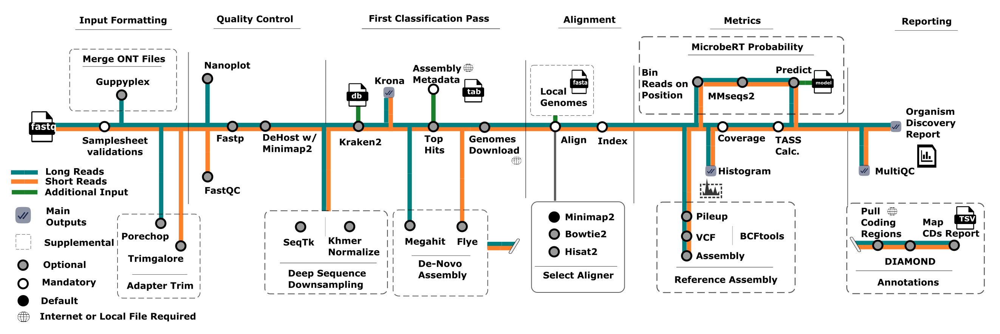
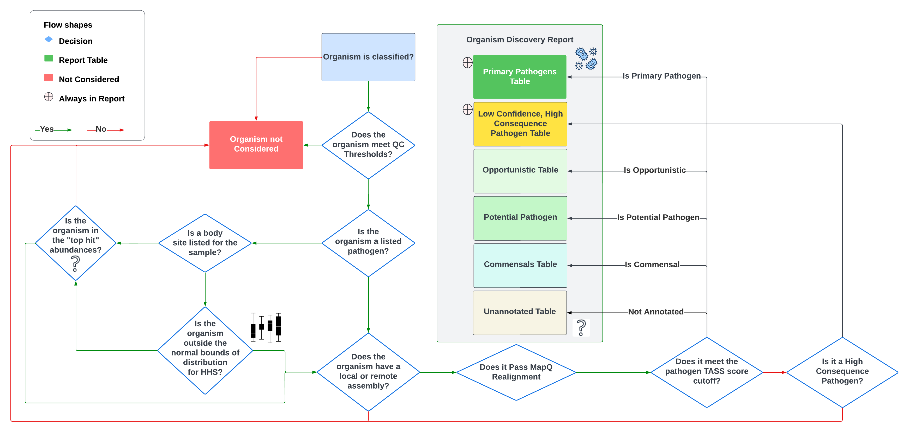

# nf-core/taxtriage: Usage

## :warning: Please read this documentation on the nf-core website: [https://nf-co.re/taxtriage/usage](https://nf-co.re/taxtriage/usage)

> _Documentation of pipeline parameters is generated automatically from the pipeline schema and can no longer be found in markdown files._

## Introduction

<!-- TODO nf-core: Add documentation about anything specific to running your pipeline. For general topics, please point to (and add to) the main nf-core website. -->

## Samplesheet input

You will need to create a samplesheet with information about the samples you would like to analyse before running the pipeline. Use this parameter to specify its location. It has to be a comma-separated file with 3 columns, and a header row as shown in the examples below.

```console
--input '[path to samplesheet file]'
```

### Multiple Samples

The `sample` identifiers have to be the same when you have re-sequenced the same sample more than once e.g. to increase sequencing depth. The pipeline will concatenate the raw reads before performing any downstream analysis. Below is an example for the same sample sequenced across 3 lanes:

```console
sample,platform,fastq_1,fastq_2,sequencing_summary,trim,type
NB03,OXFORD,examples/data/fastq_demux/NB03,,,FALSE,nasal
BC05_flu,OXFORD,examples/data/BC05.fastq.gz,,,FALSE,nasal
longreads,OXFORD,examples/data/nanosim_metagenome.fastq.gz,,,FALSE,gut
shortreads,ILLUMINA,examples/data/iss_reads_R1.fastq.gz,examples/data/iss_reads_R2.fastq.gz,,TRUE,blood
```

Supported "type" available from HMP

1. stool
2. oral
3. throat
4. skin
5. vaginal

Any other body site not listed will not take HMP into consideration. Only abundances hitting the "threshold" for top hits `--top_hits` or `--top_per_taxa` will be considered. See [here](https://github.com/jhuapl-bio/taxtriage/blob/main/assets/TASSDiagram.png) for decision tree information on how top hits are calculated at a high level. See [here](https://github.com/jhuapl-bio/taxtriage/blob/main/docs/usage.md#cli-parameters-possible-and-explained) for parameter descriptions.


### Multiple Samples AND Platforms

The `sample` identifiers have to be the same when you have re-sequenced the same sample more than once e.g. to increase sequencing depth. The pipeline will concatenate the raw reads before performing any downstream analysis. Below is an example for the same sample sequenced across 3 lanes:

```console
sample,platform,fastq_1,fastq_2,sequencing_summary,trim,type
NB03,OXFORD,examples/data/fastq_demux/NB03,,,FALSE,nasal
BC05_flu,OXFORD,examples/data/BC05.fastq.gz,,,FALSE,nasal
longreads,OXFORD,examples/data/nanosim_metagenome.fastq.gz,,,FALSE,gut
shortreads,ILLUMINA,examples/data/iss_reads_R1.fastq.gz,examples/data/iss_reads_R2.fastq.gz,,TRUE,blood
```


### Tips

Unless you are using NF Tower, most of the temporary directories and final outputs will be present on your filesystem. By default, all temporary files are generated in `--work-dir` which is set to `work` by default. A handy tip is to look at the status of each module/step in the stdout if you want to debug a specific step for whatever reason. For example, you can navigate to the example dir like so:

1. Find the start of the location of the specific module and its input/output file(s)

  >This directory name is in `work/`>>[28/5412a9] process > NFCORE_TAXTRIAGE:TAXTRIAGE:KRAKEN2_KRAKEN2 (longreads)  [100%] 2 of 2 ✔

3. Copy and Paste the `--work-dir` and then the start of the directory we see for that module. For example: `cd work/28/5412a9
4. Hit "tab" to tab-complete the full path of the subdirectory within the first directory and `work`. For example, for my system it is `cd work/28/5412a9ea5c05fde928d8cf489bc48d/`
5. View the command output from the run: `cat .command.out`
6. Rerun the command: `bash .command.sh` in the same directory.
   - If you have the command in your global env, you can run it directly without changing anything.
   - Be aware that for non-globally installed commands/tools you need to reference the location of the python/bash scripts. They are usually in the dir: `../../../bin/command.py`. So, simply edit with `nano` or `vim` and add `../../../bin/` in from of the python/bash script and then run `bash .command.sh`

### Samplesheet Information

| Column               | Description                                                                                                                                                                            |
| -------------------- | -------------------------------------------------------------------------------------------------------------------------------------------------------------------------------------- |
| `sample`             | **MANDATORY** Custom sample name. This entry will be identical for multiple sequencing libraries/runs from the same sample. Spaces in sample names are automatically converted to underscores (`_`). |
| `platform`           | **MANDATORY** Platform used, [ILLUMINA, OXFORD]. If omitted or left blank, assumes ILLUMINA                                                                                                                                                     |
| `fastq_1`            | **MANDATORY** Full path to FastQ file for Illumina short reads 1 OR OXFORD reads. File MUST be gzipped and have the extension ".fastq.gz" or ".fq.gz".               |
| `fastq_2`            | OPTIONAL Full path to FastQ file for Illumina short reads 2. File MUST be gzipped and have the extension ".fastq.gz" or ".fq.gz".                                                     |
| `trim`               | OPTIONAL TRUE/FALSE, do you want to run trimming on the sample?                                                                                                                                 |
| `sequencing_summary` | OPTIONAL If detected, output plots based on the the sequencing summary file for that sample                                                                                           |

An [example samplesheet](../examples/Samplesheet.csv) has been provided with the pipeline alongside some demo data.

## Running the pipeline

The typical command for running the pipeline is as follows:

```console
nextflow run nf-core/taxtriage --input samplesheet.csv --outdir ./$OUTDIR -profile docker
```

:warning: please be aware that for local instances, due to limited resources, we have defined several config profiles. Please try `-profile test,docker` for a trial run of dummy data and then use `-profile local,docker` first on your own data before manually adjusting parameters

This will launch the pipeline with the `docker` configuration profile. See below for more information about profiles.

Note that the pipeline will create the following files in your working directory:

```console
work                # Directory containing the nextflow working files
<OUTIDR>            # Finished results in specified location (defined with --outdir)
.nextflow_log       # Log file from Nextflow
# Other nextflow hidden files, eg. history of pipeline runs and old logs.
```

### CLI Parameters Possible and Explained

| Parameter                                             | Description                                                                                                                                                                                                                                                                                                                                                                                                                       |
| ----------------------------------------------------- | --------------------------------------------------------------------------------------------------------------------------------------------------------------------------------------------------------------------------------------------------------------------------------------------------------------------------------------------------------------------------------------------------------------------------------- |
| `--input <samplesheet.csv_path>`                      | CSV file containing samplesheet information for each sample. See [Samplesheet section](#samplesheet-information)                                                                                                                                                                                                                                                                                                                  |
| `--outdir <path_to_output_to_be_made>`                | Output folder.            |
| `--denovo_assembly`                                     | Perform the de-novo assembly process. Currently this is recommmended as spades. Disabled by default           |
| `--reference_assembly`                                     | Perform the reference-based assembly on reads against top hit assemblies or assemblies provided as a local file. Performes variant analysis by default. Disabled by default       |
| `--skip_fastp`                                        | TRUE/FALSE, do not filter with fastp     |
| `--skip_plots`                                        | TRUE/FALSE, do not make any plots  |
| `--remove_taxids  <numbers[]>`                        | "taxidA taxidB..." a list of one or more taxids to remove from the kraken report prior to downstream analysis. Use "9606" for human reads    |
| `--k2_confidence  <numbers[]>`                        | Minimum confidence to classify a read using KRAKEN2 only. See [here](https://github.com/DerrickWood/kraken2/blob/master/docs/MANUAL.markdown#confidence-scoring) for more information.  |
| `--organisms  <numbers[] or strings[]>`    |  Organisms list (names or taxids)  you want to pull from to get a reference. Used if you are skipping kraken2 only. Separate by a list of spaces like "1254 573"  |
| `--fuzzy`                                  | TRUE/FALSE, Match names of organisms by their names (enabled) rather than taxids  |
| `--get_pathogens`                                        | TRUE/FALSE, Use the pathogens sheet FASTA file instead of k2's top hits. Default is FALSE    |
| `--skip_realignment`                                  | TRUE/FALSE, Skip realignment step. You will not get a metrics report as a result   |
| `--skip_kraken2`                                  | TRUE/FALSE, Skip kraken2. If you do not provide a --reference_fasta value and you enable this skip then your pipeline will fail.    |
| `--pathogens`                                  | OPTIONAL. Enable pathogen discovery mode. See assets/pathogen_sheet.txt for the default sheet. You can ue your own designation so long as it is in the same format as the provided example. This is an ongoing list of annotated known human-pathogens that are mapped to your alignments. Requires alignment to be performed. The "test" config profile automatically uses this.  |
| `--skip_multiqc`                                  | TRUE/FALSE, Skip multiqc final report   |
| `--minq <number>`                                     | What minimum quality would you want in your samples. Disabled if you run --skip_fastp. Default is 7 for Oxford Nanopore, 20 for Illumina   |
| `--minmapq <number>`                                     | What minimum mapping quality would you want in your sample alignments. Default is 5   |
| `--organisms_file <file>`                                     | A single file that contains what organisms (name or taxid) you want to pull. You can enable this if you are skipping kraken2 as well    |
| `--subsample <number>`                                | Take a subsample of n reads from each sample. Useful if your data size is very large and you want a quick triage analysis                                                                                                                                                                                                                                                                                                         |
| `--reference_fasta <filepath>`                        | Location of a reference fasta to run alignment on RATHER than downloading references from NCBI. Useful if you know what you're looking for or have no internet connection to pull said references                                                                                                                                                                                                                                 |
| `--db <path_to_kraken2_database>`                     | Database to be used. IF `--low_memory` is called it will read the database from the fileystem. If not called, it will load it all into memory first so ensure that the memory available (limited as well by `--max_memory` is enough to hold the database). If using with --download-db, choose from download options {minikraken2, flukraken2} instead of using a path. [See here for a full list](#supported-default-databases) |
| `--download_db`                                       | Download the preset database indicated in `--db` to `--outdir`                                                                                                                                                                                                                                                                                                                                                                    |
| `--metaphlan` | Use Metaphlan. Must specify a database path that contains .pkl and .btl2 (bowtie2 index) files                                                                                                                                                                    |
| `--max_memory <number>GB`                             | Max RAM you want to dedicate to the pipeline. Most of it will be used during Kraken2 steps so ensure you have more memory than the size of the `--db` called                                                                                                                                                                                                                                                                      |
| `-latest`                                             | Use the latest revision (-r). If you want to autopull the latest commit for a branch from https://github.com/jhuapl-bio/taxtriage, specify this. Used in Basestack and the Cloud (default toggle)                                                                                                                                                                                                                                 |
| `--low_memory <number>`                               | If you don't have enough memory to load the kraken2 db, call this to read it from the filesystem for each read. THIS IS MUCH SLOWER THAN THE DEFAULT METHOD                                                                                                                                                                                                                                                                       |
| `--max_cpus <number>`                                 | Max CPUs you want to dedicate to the pipeline                                                                                                                                                                                                                                                                                                                                                                                     |
| `--top_per_taxa "<taxid:amount:rank>"]`                  | One or more 3 element values for the minimum taxa at a rank. Example "10239:20:S 2:20:S" is minimum 20 virus species (10239 is Virus) AND (separated by space for a new definition) 20 Bacteria (2) species. Possible Rank codes to use are the single alphabet letter: G(enus),S(pecies),P(hylum),F(amily),O(rder),C(lass)                                                                                                                                                                                  |
| `--genome`                                            | Pull one of the pre-made igenomes databases. Available list at [here](https://github.com/nf-core/rnaseq/blob/e049f51f0214b2aef7624b9dd496a404a7c34d14/conf/igenomes.config#L22) or [here](https://ewels.github.io/AWS-iGenomes/) (aws cli or curl command) to download them locally                                                                                                                                               |
| `--remove_reference_file`                             | Remove all reads that align to a set of accessions in a single fasta file                                                                                                                                                                                                                                                                                                                                                         |
| `--demux`                                             | If your Samplesheet contains a folder (rather than 1-2 fastq files), you MUST call this flag                                                                                                                                                                                                                                                                                                                                      |
| `--top_hits_count`                                    | Minimum taxa to filter out per rank level. If top_per_taxa specified, whatever is the larger of the 2 values for the results takes priority.                                                                                                                                                                                                                                                                                      |
| `--get_features`                                    | Pull Features (CDS) for each assembly present. Performs Coverage on each feature                                                                                                                                                                                                                                                                                |
| `--get_variants`                                    | Perform mpileup on your assemblies against your reads. Disabled by default. Auto-called if you are doing a reference-based assembly                                                                                                                                                                                                                                                                                |
| `-resume`                                             | Resume the run from where it left off. IF not called the pipeline will restart from the Samplesheet check each time                                                                                                                                                                                                                                                                                                               |
| `-r [main, stable, etc.]`                             | Specify the branch/revision name to use if pulling from github (not local main.nf file)                                                                                                                                                                                                                                                                                                                                           |
| `-profile [local,test,test_viral,docker,singularity]` | Default profile, 2 tests, Docker, or Singularity for execution reasons                                                                                                                                      

### Important output locations

- `reports`: Metagenomics Discovery Report PDF
- `krona`: `<samplename>.html`  -combined_krona_kreports.html ”sunburst” plot for kraken2 – pre re-alignment step - optional
- `samtools`: Raw Alignment stats output
  - Coverage (v1.2.2 or later) - `<samplename>.txt`
  - `Histogram` (v1.3.0 or later) - `<samplename>.histo.txt`
  - `Depth` (v1.2 or later) - `<samplename>.tsv`
    - Each contig/chromosome is present in this file, 3rd column is depth at position (col 2). 
- `bcftools`: Variant And Consensus – Optional Module (--reference_assembly called)
  - Variants - `<samplename>.<taxid>.vcf.gz`
  - Consensus - `<samplename>.consensus.fa`
- `merge`: Aggregate Stats on Alignment + Kraken2
- `confidence`: Confidence Table `confidences.merged_mqc.tsv`
  - Contains post alignment and kraken2 confidence values for each sample + contig/chromosome per taxa
- `multiqc` – Confidence Metrics and Supplemental Plots Location
- `nanoplot`/`fastqc` – QC plots and stats 
- `minimap2` / `bowtie2` – Location of raw re-alignment bam files
- `mergedkrakenreport` – `krakenreport.merged_mqc.tsv` - Top Hits for each sample – Agnostic kraken2 only

### General Procedure

There are a lot of moving parts in the pipeline (see Figure 1) for a detailed railway map of modules



Ultimately, the pipeline has several mandatory and optional steps that can be defined as:

1. Trimming and QC
   - Includes plots of QC filtering metrics
3. Host Removal (alignment-based)
   - Duplicates unclassified (non-host) reads.
   - [Minimap2](https://github.com/lh3/minimap2) is used for both data types (short or long reads) based on a [study](https://www.ncbi.nlm.nih.gov/pmc/articles/PMC9040843/) conducted showing a slightly lower false negative rate relative to [Bowtie2](https://bowtie-bio.sourceforge.net/bowtie2/index.shtml)
4. Kraken2 Metagenomics Classification
   - Includes Krona Plots - a **very** important file for initial understanding abundance from a metagenomics perspective. 
   - This is skippable if you assign `--reference_fasta` FASTA file or the `--organisms/--organisms_file` parameters. (set: `--skip_kraken2`)
   - Always consider limitations in your database of use. See [databases](https://benlangmead.github.io/aws-indexes/k2) publicly available. 
5. Top Hits Assignments
   - See Figure 2 for flow diagram on decision tree
6. Reference Prep
   - Assemblies based on top hits are pulled from NCBI - Required Internet connection and the relative assembly to be findable
     - If skipping Kraken2 and using a local FASTA file, this part is skipped.
   - Index built for each reference FASTA file (Bowtie2 only - Illumina reads)
7. Alignment
   - Pulled/local assemblies are aligned to ALL classified reads (if using Kraken2) or raw reads (if using local FASTA reference) post-QC steps. Currently, only the "best hits" are assigned per read. Soon to introduce a parameter to raise that limit.
   - Currently, we separate short and long reads to be run between Bowtie2 & Minimap2, respectively. While various studies have been performed and declared minimap2 to be highly performative for short reads, a few indicate that from a taxonomic/metagenomics perspective [Minimap2 still underperforms relative to Bowtie2](https://www.ncbi.nlm.nih.gov/pmc/articles/PMC9040843/). We will actively track performances as these platforms continue to be updated to ensure the optimal aligner is used for each data type. 
8. Stats
   - Generate Coverage histogram (`samtools/samplename.histo.txt`)
   - Generate Depth (`samtools/samplename.tsv`)
9. Reference Assembly (optional - set `--reference_assembly` to enable)
   - This is a long process
   - Generates VCF (variant) files in `bcftools/samplename.vcf.txt`)
   - Generates Assembly file(s) in `bcftools/samplename.consensus.fa`
10. Organism Discovery Report Analysis
    - MultiQC - Raw alignment information and stats found in `multiqc/multiqc_report.html`
    - Simplified Report (Main Report) - Found in `report/pathogens.report.pdf`
        - Contains all downstream-passed alignments and their classification in the first table (see example report in Figure 3)
        - Primary report to understand and perform reflex reponse on.


<span>Figure 3</span>
</img>

The distribution metrics are defined based on a all publicly available healthy human subjects (HHS) available from [HMP](https://hmpdacc.org/). Because these runs are lilsted as SRA accessions, they all contain NCBI's taxonomy analysis table metadata. That is, we are able to extract taxonomic abundances for each of the samples provided. Using standard distribution metrics, we designate a default z-score of 1.5 to mark irregularities outside of those bounds for any given species/subspecies/strain for each body site. This is, of course, limited in that the organism MUST be annotated and found within a given body site. Any organism (based on taxid mapping) **not** found is considered irregular, regardless of relative abundance. 


Additionally, any organism deemed a potential or primary pathogen from our curated pathogen sheet of ~1600 taxa ([see here for more info](#top-hits-calculation)) is included in the Organism discovery analysis, regardless of relative abundance. 

Finally, we mark alignment confidence using the gini coefficient, which has recently been applied from standard inequality identification practices in economics to [biologically based gene expression analysis](https://www.cell.com/cell-systems/pdf/S2405-4712(18)30003-6.pdf). The goal is to understand, in a manner separate of organism classification or identity, how well an alignment should be considered trustworthy based on the inequality of depth and breadth of coverage for all contigs/chromosomes/plasmid found for a given realignment to an assembly. Ultimately, low confidence indicates a very low level of equal distribution across a genome. The goal is to ensure that, while there may be a **large** number of reads aligniing to one organism, we are analyzing whether or not most reads are situtated in only a small number of positions across that assembly. Values are reported from 0 (low confidence) to 1 (high confidence), inclusively.

### Top Hits Calculation

In order to retain an "agnostic" approach for organism while allowing adequate alignments to take place in a reasonable amount of time, we employ the "top hits" approach to the pipeline (see Figure 2). This is designed to allow users to still pull commensals or non-pathogens that have not been annotated in our curated [pathogen sheet](https://github.com/jhuapl-bio/taxtriage/blob/main/assets/pathogen_sheet.csv) to still be available in the confidence metrics and reports. Users should adjust the `--top_per_taxa` and `--top_hits` as freely as needed based on the source of their sample(s). 


### Supported Default databases (Kraken2 only)

| Database Name | Location                                                                                                  | Size |
| ------------- | --------------------------------------------------------------------------------------------------------- | ---- |
| standard8     | [Download](https://genome-idx.s3.amazonaws.com/kraken/k2_standard_08gb_20230605.tar.gz)                   | 7.5G |
| viral         | [Download](https://genome-idx.s3.amazonaws.com/kraken/k2_viral_20230605.tar.gz)                           | 553M |
| flukraken2    | [Download](https://media.githubusercontent.com/media/jhuapl-bio/mytax/master/databases/flukraken2.tar.gz) | 180M |
| test          | [Download](https://github.com/jhuapl-bio/datasets/raw/main/databases/kraken2/test_metagenome.tar.gz)      | 112M |
| minikraken2   | [Download](https://genome-idx.s3.amazonaws.com/kraken/minikraken2_v2_8GB_201904.tgz)                      | 7.5G |

- Kraken2 additional AWS databases [here](https://benlangmead.github.io/aws-indexes/k2)
- Metaphlan4 [here](http://cmprod1.cibio.unitn.it/biobakery4/metaphlan_databases/) - Download the .tar files

## AWS with Nextflow Tower

While we support Taxtriage in both Basestack and native and local CLI deployment, you can also import and run code from Nextflow Tower. This process can be convoluted in order to get it applicable for cloud environments but, once fully setup, becauses very easy to reproduce at low cost on AWS. Please be aware of sensitivity of data when working in the cloud

1. First, you must create a [Nextflow Tower](https://cloud.tower.nf/) account

- Further documentation for the following steps can be found [here](https://help.tower.nf/22.2/)

2. Request a user account to brian.merritt@jhuapl.edu

- Information for accessing the S3 Buckets and creating a credential-specific Compute environment will be included in the email

3. At this point follow all steps for setting up AWS in the following link. [View Steps Here](images/Cloud_AWS_NFTower_only/Cloud_AWS_NFTower_only.pdf)

#### Running Within NF Tower

By default, you should have access to TaxTriage's launchpad for your specific organization if your account was set up by JHU/APL. If you don't see it, please let an admin know. 

To access your launchpad, select the drop-down and your organization name. There is also a "Shared" workspace that is viewable and public to all users of the TASS program on NF Tower. 

1. Select the Dropdown near the top-left of the page.

[Select Drop Down](dropdown_nftower.png)

2. Then, select your organization that should appear:

[Select Organization](Access_launchpad_NFTower.png)


3. Next, Run the pipeline from the Launchpad. Be aware that all inputs to the S3 bucket are tailored for my example. You own inputs will vary including things like `low_memory` or database name used

By default, the pipeline should be called TASS for the default instance. It comes pre-loaded with default inputs which can be used for a quick launch to see how things work in your space. For your own data, you'll need to upload the files (samplesheet and fastq reads, compressed as `.gz`) to the S3 bucket of your organization. See the instructions on how to do that [below](#working-with-your-own-data-nf-tower)

In this below video, we see the default launchpad pipeline present. On loading there are some default values where you can edit as you see fit. When you've successfully completed all the inputs you need, you can either:

A. Select "Launch" to start the pipeline or (see below) update and refine some additional environmental configurations (see below video). On a job starting, you will be redirected to your running list of all jobs, completed or otherwise.

[cloud_run_2.webm](https://user-images.githubusercontent.com/50592701/192596313-7e30f285-dc1d-4c62-99d2-5791a5d8c0e9.webm)

In this page, instead of hitting "Launch" the user selected "launch settings". For this page, you can review the JSON of all parameter that are to be submitted and edit as you see fit directly in the text box. You can update the "branch" used from the Github Repo (default is "main"). This is expecially useful to learn about as when you "Relaunch" a pipeline, you will be redirected to this page which is the overview of all configurations you set for that specific job. 

[cloud_run_3.webm](https://user-images.githubusercontent.com/50592701/192596272-46007980-cc07-46c3-978f-e1846adbfffb.webm)

Within a job, you can view the state of all steps and modules that are running/have completed. It is particularly useful in that you can check the "Execution Log" to see the current state of the pipeline in the form of stdout/stderr.

[cloud_run_1.webm](https://user-images.githubusercontent.com/50592701/192596324-57162d50-2738-4b7f-ba8c-2fa473ca1433.webm)

By clicking each of the module names closer to the bottom (e.g. Kraken2, FastQC, etc.) you can view the individual command used and general information on the data made and the log for that specific job. Any errors and successes will be noted with an icon.

#### Working with your own data NF Tower

When all necessary items have been setup, you'll need to load your data you want to run into an S3 bucket. Be aware that all filesystem refrences to files/directories need to be relative to the S3 bucket. However, with things like the Samplesheet, the paths can be relative only within the S3 bucket so you don't need to use things like `S3://bucketname/path/to/file `


In the above example, I've made an s3 bucket with necessary permissions for nextflow-tower to run. I have a directory with the same test-data you can find in the `examples` directory in the root level of this bit of code [here](../examples)

Once the AWS system is setup, let's head back to Nextflow Tower. On the left, you can select a drop-down and open up your own personal launchpad (and other features)


MAKE SURE that the compute environment matches the one you set up when you set your credentials if you're not using the JHUAPL-provided NF Tower instance. See [official docs](https://abhi18av.github.io/nf-tower-docs-orgs-and-teams/21.04.temp3/compute-envs/overview/) for setting up your own compute system with its own billing. 

If you expand the pipeline parameters, you can mimic what I've written for my example with your own paths for the S3 bucket and example data. Note that these are going to be identical to the parameters available at [here](#cli-parameters-possible-and-explained)


### Reproducibility

It is a good idea to specify a pipeline version when running the pipeline on your data. This ensures that a specific version of the pipeline code and software are used when you run your pipeline. If you keep using the same tag, you'll be running the same version of the pipeline, even if there have been changes to the code since.

First, go to the [nf-core/taxtriage releases page](https://github.com/nf-core/taxtriage/releases) and find the latest version number - numeric only (eg. `1.3.1`). Then specify this when running the pipeline with `-r` (one hyphen) - eg. `-r 1.3.1`.

This version number will be logged in reports when you run the pipeline, so that you'll know what you used when you look back in the future.

## Core Nextflow arguments

> **NB:** These options are part of Nextflow and use a _single_ hyphen (pipeline parameters use a double-hyphen).

### `-profile`

Use this parameter to choose a configuration profile. Profiles can give configuration presets for different compute environments.

Several generic profiles are bundled with the pipeline which instruct the pipeline to use software packaged using different methods (Docker, Singularity, Podman, Shifter, Charliecloud, Conda) - see below. When using Biocontainers, most of these software packaging methods pull Docker containers from quay.io e.g [FastQC](https://quay.io/repository/biocontainers/fastqc) except for Singularity which directly downloads Singularity images via https hosted by the [Galaxy project](https://depot.galaxyproject.org/singularity/) and Conda which downloads and installs software locally from [Bioconda](https://bioconda.github.io/).

> Only Docker and Singularity are currently supported for profile types. There may be efforts to update for additional platforms in the future. 

The pipeline also dynamically loads configurations from [https://github.com/nf-core/configs](https://github.com/nf-core/configs) when it runs, making multiple config profiles for various institutional clusters available at run time. For more information and to see if your system is available in these configs please see the [nf-core/configs documentation](https://github.com/nf-core/configs#documentation).

Note that multiple profiles can be loaded, for example: `-profile test,docker` - the order of arguments is important!
They are loaded in sequence, so later profiles can overwrite earlier profiles.

If `-profile` is not specified, the pipeline will run locally and expect all software to be installed and available on the `PATH`. This is _not_ recommended.

- `docker`
  - A generic configuration profile to be used with [Docker](https://docker.com/)
- `singularity`
  - A generic configuration profile to be used with [Singularity](https://sylabs.io/docs/)

### `-resume`

Specify this when restarting a pipeline. Nextflow will use cached results from any pipeline steps where the inputs are the same, continuing from where it got to previously. For input to be considered the same, not only the names must be identical but the files' contents as well. For more info about this parameter, see [this blog post](https://www.nextflow.io/blog/2019/demystifying-nextflow-resume.html).

You can also supply a run name to resume a specific run: `-resume [run-name]`. Use the `nextflow log` command to show previous run names.

## Custom configuration

### Updating containers

The [Nextflow DSL2](https://www.nextflow.io/docs/latest/dsl2.html) implementation of this pipeline uses one container per process which makes it much easier to maintain and update software dependencies. If for some reason you need to use a different version of a particular tool with the pipeline then you just need to identify the `process` name and override the Nextflow `container` definition for that process using the `withName` declaration. For example, in the [nf-core/viralrecon](https://nf-co.re/viralrecon) pipeline a tool called [Pangolin](https://github.com/cov-lineages/pangolin) has been used during the COVID-19 pandemic to assign lineages to SARS-CoV-2 genome sequenced samples. Given that the lineage assignments change quite frequently it doesn't make sense to re-release the nf-core/viralrecon everytime a new version of Pangolin has been released. However, you can override the default container used by the pipeline by creating a custom config file and passing it as a command-line argument via `-c custom.config`.

### nf-core/configs

In most cases, you will only need to create a custom config as a one-off but if you and others within your organisation are likely to be running nf-core pipelines regularly and need to use the same settings regularly it may be a good idea to request that your custom config file is uploaded to the `nf-core/configs` git repository. Before you do this please can you test that the config file works with your pipeline of choice using the `-c` parameter. You can then create a pull request to the `nf-core/configs` repository with the addition of your config file, associated documentation file (see examples in [`nf-core/configs/docs`](https://github.com/nf-core/configs/tree/master/docs)), and amending [`nfcore_custom.config`](https://github.com/nf-core/configs/blob/master/nfcore_custom.config) to include your custom profile.

See the main [Nextflow documentation](https://www.nextflow.io/docs/latest/config.html) for more information about creating your own configuration files.

If you have any questions or issues please send us a message on [Slack](https://nf-co.re/join/slack) on the [`#configs` channel](https://nfcore.slack.com/channels/configs).

## Running in the background

Nextflow handles job submissions and supervises the running jobs. The Nextflow process must run until the pipeline is finished.

The Nextflow `-bg` flag launches Nextflow in the background, detached from your terminal so that the workflow does not stop if you log out of your session. The logs are saved to a file.

Alternatively, you can use `screen` / `tmux` or similar tool to create a detached session which you can log back into at a later time.
Some HPC setups also allow you to run nextflow within a cluster job submitted your job scheduler (from where it submits more jobs).

## Nextflow memory requirements

In some cases, the Nextflow Java virtual machines can start to request a large amount of memory.
We recommend adding the following line to your environment to limit this (typically in `~/.bashrc` or `~./bash_profile`):

```console
NXF_OPTS='-Xms1g -Xmx4g'
```
